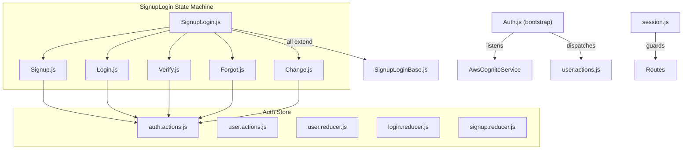

# Auth Module Documentation

> **Directory:** `src/app/auth/` · **Files:** 12
> **Dependencies:** AWS Cognito, formsy-react, react-i18next, Redux, react-router
> **Purpose:** User authentication lifecycle — signup, login, email verification, password reset, and session management.

---

## Architecture Overview

---

## 1. Bootstrap — `Auth.js` (85 lines)

Entry point component that initializes authentication on app load.

| Event                   | Handler                                             |
| ----------------------- | --------------------------------------------------- |
| `onAutoLogin(idToken)`  | Set user data from Cognito token, mark `init: true` |
| `onNoSession`           | Logout user, mark `init: true`                      |
| `onAutoLogout(message)` | Show message snackbar, logout, mark `init: true`    |

**Before init:** Shows splash screen with ezCheckMe logo and animated progress bar.
**After init:** Renders children (the rest of the app).
**Also calls:** `getConnectionData()` to check API connectivity.

---

## 2. Session Guard — `session.js` (21 lines)

Simple route guard component. If `user.role` is `'guest'` or `'unknown'`, redirects to `/home`. Otherwise renders children.

---

## 3. SignupLogin Dialog System

### SignupLogin.js (124 lines) — State Machine Controller

Manages dialog state transitions between 5 forms:

| State     | Component  | Dialog Size |
| --------- | ---------- | ----------- |
| `SIGNUP`  | `<Signup>` | 680px       |
| `LOGIN`   | `<Login>`  | 560px       |
| `CONFIRM` | `<Verify>` | 520px       |
| `FORGOT`  | `<Forgot>` | —           |
| `CHANGE`  | `<Change>` | —           |

**Props:** `dialogType`, `closeDialog`, `verificationCode`, `referralCode`, `verificationEmail`, `openDialog`

All child forms receive `onToggleForm(toState, populate)` to navigate between states.

### SignupLoginBase.js (87 lines) — Base Class

All form components extend this. Provides:

| Method                                   | Description                                  |
| ---------------------------------------- | -------------------------------------------- |
| `emailChange(event)`                     | Updates user email in Redux                  |
| `enableSubmit() / disableSubmit()`       | Controls submit button via formsy validation |
| `submitButton(text)`                     | Renders submit button with loading spinner   |
| `cancelButton(text, onClick, isPrimary)` | Renders cancel/close button                  |

### Signup.js (299 lines)

Host signup form with fields: first name, last name, email, password, password confirm, organization, terms checkbox.

| Feature         | Detail                                                             |
| --------------- | ------------------------------------------------------------------ |
| Blocked domains | Fetches via `ezDataService.getBlockedEmailDomains()` and validates |
| Password policy | Regex: min 8 chars, letters + digits + special chars               |
| Analytics       | Sends `host-signup-` event on success                              |
| Post-signup     | Navigates to CONFIRM state with email populated                    |

### Login.js (215 lines)

Login form with email, password, and "remember me" checkbox.

| Feature          | Detail                                                                       |
| ---------------- | ---------------------------------------------------------------------------- |
| Keep logged in   | Persisted via `storeSessionActivityData` / `getIfToKeepLoggedIn`             |
| Post-login       | Sends analytics, closes dialog, does `window.location.href = "/courses"`     |
| Error handling   | Shows translated error message                                               |
| Navigation links | "Create an account" → SIGNUP, "Verify" → CONFIRM, "Forgot password" → FORGOT |

### Verify.js (163 lines)

Email verification code form with email + confirmation code fields.

| Feature          | Detail                                                   |
| ---------------- | -------------------------------------------------------- |
| Already verified | Detects `"Current status is CONFIRMED"` in error         |
| Post-verify      | Sends `host-confirm-code` gtag event, navigates to LOGIN |

### Forgot.js (170 lines)

Password reset request. Submits email to get reset code.

| Feature | Detail                                           |
| ------- | ------------------------------------------------ |
| Success | Shows success message UI (code sent to email)    |
| Cancel  | Redirects to `/home` if not already on home page |

### Change.js (228 lines)

Password change form (after receiving reset code). Fields: confirmation code (hidden, auto-filled), new password, confirm password.

| Feature         | Detail                                                             |
| --------------- | ------------------------------------------------------------------ |
| Password policy | Same regex as Signup: letters + digits + special chars, min 8      |
| Post-change     | Shows success message, auto-redirects to `/login` after 10 seconds |

---

## 4. Auth Store (covered in `docs/redux-store.md`)

The auth store contains:

- **`auth.actions.js`** — `submitSignup`, `submitLogin`, `submitConfirmation`, `forgotPassword`, `forgotPasswordSubmit`, `submitHostSignup`, `submitAttendeeSignup`, `resendVerificationCode`
- **`user.actions.js`** — `setUserData`, `setUserDataAwsCognito`, `logoutUser`, `getConnectionData`, `impersonateLogin`, dialog controls
- **`user.reducer.js`** — User profile, role, settings, dialog states
- **`login.reducer.js`** — Login success/error
- **`signup.reducer.js`** — Signup success/error

---

## 5. Rebuild Notes

> [!IMPORTANT]
> **Must preserve:**
>
> - Auto-login flow via Cognito session tokens
> - Dialog state machine (SIGNUP → CONFIRM → LOGIN flow)
> - Blocked email domain validation

- Domains are **API-fetched** at mount via `ezDataService.getBlockedEmailDomains()` (not hardcoded)
- Returns `{ blockedDomains: [{ domain }], allowedEmails: [{ email }], restriction: "exact" | undefined }`
- Validation order: check `allowedEmails` whitelist first (exact or contains match), then reject if email contains any `blockedDomains` entry
- Analytics event fired on blocked email: `"not institutional email signup attempt"`
  > - "Remember me" session persistence
  > - Password policy enforcement

> [!TIP]
> **Recommended improvements:**
>
> 1. Replace class components with functional components + hooks
> 2. Replace formsy-react with React Hook Form or Zod validation
> 3. Replace `window.location.href` navigation with React Router `navigate()`
> 4. Move Cognito service integration to a custom hook
> 5. Replace `SignupLoginBase` inheritance with composition (shared hooks/components)
> 6. Remove the `session.js` component in favor of route-level guards
