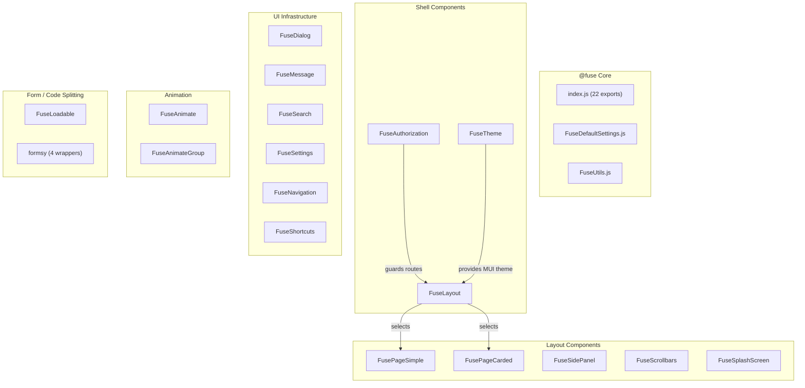

# Fuse React Framework Documentation

> **Directory:** `src/@fuse/` · **Version:** Fuse React 2.2.5
> **Files:** 39 · **Dependencies:** Material UI v4, velocity-react, perfect-scrollbar, react-loadable, formsy-react, react-autosuggest
> **Purpose:** Application shell framework providing layout system, theming, navigation, authorization, animations, and UI infrastructure.

---

## Architecture Overview

---

## 1. Shell Components

### FuseLayout — `FuseLayout/FuseLayout.js` (115 lines)

Dynamic layout selector. Reads `settings.layout.style` from Redux and renders the corresponding layout from `FuseLayouts` map. Merges per-route settings on navigation changes.

| Prop/State        | Source                   | Description                             |
| ----------------- | ------------------------ | --------------------------------------- |
| `settings`        | `fuse.settings.current`  | Current settings including layout style |
| `defaultSettings` | `fuse.settings.defaults` | Default settings for reset              |

**Key behavior:** On route change, calls `routeSettingsCheck()` which uses `matchRoutes` to find the current route's custom settings and merges them with defaults.

**HOC chain:** `withStyles` → `withRouter` → `connect`

### FuseAuthorization — `FuseAuthorization/FuseAuthorization.js` (103 lines)

Role-based route guard. Checks `route.auth` array against `user.role`.

| Logic                  | Description                                          |
| ---------------------- | ---------------------------------------------------- |
| Route has `auth` array | Only renders children if `user.role` is in the array |
| Route has no `auth`    | Always grants access                                 |
| Guest denied           | Redirects to `/login` with `redirectUrl` in state    |
| Authenticated denied   | Redirects to `/` or saved `redirectUrl`              |

**Redux:** Reads `auth.user` for role checking.

### FuseTheme — `FuseTheme/FuseTheme.js` (24 lines)

Wraps children in MUI `MuiThemeProvider` using `mainTheme` from `fuse.settings.mainTheme`.

---

## 2. UI Infrastructure

### FuseDialog — `FuseDialog/FuseDialog.js` (57 lines)

Global draggable dialog using Redux state. Supports custom backdrops and responsive fullscreen below 800px.

| Redux State           | Description                           |
| --------------------- | ------------------------------------- |
| `fuse.dialog.state`   | Open/close boolean                    |
| `fuse.dialog.options` | Dialog options (background, id, etc.) |

**Feature:** Dialog title (`#fuse-dialog-title`) is the drag handle via `react-draggable`. Uses `StyledDialog` from `CustomElements`.

### FuseMessage — `FuseMessage/FuseMessage.js` (98 lines)

Snackbar notification system with 4 variants:

| Variant   | Color            | Icon            |
| --------- | ---------------- | --------------- |
| `success` | Green 600        | `check_circle`  |
| `error`   | Theme error dark | `error_outline` |
| `info`    | Blue 600         | `info`          |
| `warning` | Amber 600        | `warning`       |

**Redux:** `fuse.message.state` (open/close), `fuse.message.options` (variant, message, anchorOrigin).

### FuseSearch — `FuseSearch/FuseSearch.js` (448 lines)

Navigation search with autosuggest. Flattens the navigation tree and filters by user role.

| Variant | Description                                       |
| ------- | ------------------------------------------------- |
| `basic` | Inline outlined search field with Popper dropdown |
| `full`  | Overlay search that covers the toolbar area       |

**Features:** Uses `autosuggest-highlight` for match highlighting, `deburr` for accent normalization, limits to 10 results. Filters out items that the user's role cannot access.

**Redux:** `fuse.navigation` for nav items, `auth.user.role` for filtering.

### FuseSettings — `FuseSettings/FuseSettings.js` (278 lines)

Admin-facing panel for layout/theme configuration. Dynamically generates form from `FuseLayoutConfigs`.

| Feature               | Description                                   |
| --------------------- | --------------------------------------------- |
| Layout style selector | Radio group from available layouts            |
| Layout config         | Dynamic form (radio/switch/group) per layout  |
| Theme selectors       | Main, Navbar, Toolbar, Footer theme dropdowns |
| Custom scrollbars     | Toggle switch                                 |

**Redux actions:** `setDefaultSettings` (for guests), `updateUserSettings` (for authenticated users).

### FuseNavigation — `FuseNavigation/FuseNavigation.js` (125 lines)

Renders navigation tree in vertical or horizontal layouts with 5 item types:

| Type       | Vertical Component        | Horizontal Component        |
| ---------- | ------------------------- | --------------------------- |
| `group`    | `FuseNavVerticalGroup`    | `FuseNavHorizontalGroup`    |
| `collapse` | `FuseNavVerticalCollapse` | `FuseNavHorizontalCollapse` |
| `item`     | `FuseNavVerticalItem`     | `FuseNavHorizontalItem`     |
| `link`     | `FuseNavVerticalLink`     | `FuseNavHorizontalLink`     |
| `divider`  | `<Divider>`               | `<Divider>`                 |

**Responsive:** Horizontal layout shows vertical nav on `mdDown`, horizontal on `lgUp`.

8 sub-components in `vertical/` and `horizontal/` directories, plus `FuseNavBadge.js` for notification badges.

### FuseShortcuts — `FuseShortcuts/FuseShortcuts.js` (235 lines)

User-customizable quick-access shortcut bar. Renders nav items from user's `shortcuts` array.

**Features:** Star-toggle to add/remove shortcuts, search through flattened navigation, horizontal or vertical layout. Dispatches `updateUserShortcuts` to persist.

---

## 3. Layout Components

### FusePageSimple — `FusePageLayouts/FusePageSimple.js` (358 lines)

Primary page layout used across the application. Supports:

| Slot                         | Description                         |
| ---------------------------- | ----------------------------------- |
| `header`                     | Page header area                    |
| `contentToolbar`             | Toolbar row above content           |
| `content`                    | Main content area                   |
| `leftSidebarHeader/Content`  | Left sidebar with header + content  |
| `rightSidebarHeader/Content` | Right sidebar with header + content |

**Features:** Left/right sidebars with `permanent` variant, `innerScroll` mode, `sidebarInner` mode. Uses `FuseScrollbars` for custom scrolling. Admin pages use narrower 240px drawer width; default is 300px.

**CSS:** Uses gradient backgrounds (`#d5dadc` → `#ebeff1`), 660px min content width, responsive breakpoints at 1028px and 800px.

### FuseSidePanel — `FuseSidePanel/FuseSidePanel.js` (241 lines)

Collapsible side panel with desktop (Paper) and mobile (Drawer) modes. 56px wide when open, collapses to 0 with animated toggle button.

### FuseSplashScreen — `FuseSplashScreen/FuseSplashScreen.js` (31 lines)

Loading spinner shown during initial app load. Uses CSS-animated half-circle spinner.

### FuseScrollbars — `FuseScrollbars/FuseScrollbars.js` (193 lines)

`perfect-scrollbar` wrapper. Disabled on mobile devices (detected via `MobileDetect`). Supports 10 scroll event callbacks. Reads `customScrollbars` setting from Redux.

---

## 4. Animation

### FuseAnimate — `FuseAnimate/FuseAnimate.js` (34 lines)

Wrapper around `VelocityComponent` from `velocity-react`.

| Default   | Value                                  |
| --------- | -------------------------------------- |
| animation | `transition.fadeIn`                    |
| duration  | 300ms                                  |
| delay     | 50ms                                   |
| easing    | `[0.4, 0.0, 0.2, 1]` (Material Design) |

### FuseAnimateGroup — `FuseAnimateGroup/FuseAnimateGroup.js` (52 lines)

Wrapper around `VelocityTransitionGroup` for staggered enter/leave animations. Default 200ms duration, 50ms stagger.

---

## 5. Utilities

### FuseUtils — `FuseUtils.js` (417 lines)

Static utility class + `EventEmitter` class.

| Method                               | Description                                           |
| ------------------------------------ | ----------------------------------------------------- |
| `filterArrayByString(arr, text)`     | Filters array items matching search text              |
| `searchInObj/Array/String`           | Deep search helpers                                   |
| `generateGUID()`                     | UUID generator using `S4()` hex blocks                |
| `toggleInArray(item, array)`         | Add/remove toggle                                     |
| `handleize(text)`                    | URL-safe slug generator                               |
| `setRoutes(config)`                  | Convert route config to react-router routes with auth |
| `generateRoutesFromConfigs(configs)` | Batch route generation                                |
| `findById(nav, id)`                  | Deep search through nav tree                          |
| `getFlatNavigation(items)`           | Flatten nested nav to flat array                      |
| `randomMatColor(hue)`                | Random Material Design color                          |
| `difference(obj, base)`              | Deep object diff                                      |
| `updateNavItem/removeNavItem`        | Nav tree mutations                                    |
| `prependNavItem/appendNavItem`       | Nav tree insertions                                   |

### EventEmitter (embedded in FuseUtils.js)

Custom event system used by `AwsCognitoService`:

- `on(event, fn)` — register listener
- `once(event, fn)` — register one-shot listener
- `emit(event, ...args)` — fire event
- `removeListener(event, fn)` — unregister

### FuseDefaultSettings — `FuseDefaultSettings.js` (139 lines)

| Export                       | Description                                                       |
| ---------------------------- | ----------------------------------------------------------------- |
| `defaultSettings`            | Custom scrollbars, theme assignments (main/navbar/toolbar/footer) |
| `defaultThemeOptions`        | Typography: Muli + Roboto, weights 300/400/600                    |
| `mustHaveThemeOptions`       | `htmlFontSize: 10` (for rem calculations)                         |
| `defaultThemes`              | Light + dark theme palettes using `fuseDark` and `lightBlue`      |
| `getParsedQuerySettings()`   | Parse settings from URL query string                              |
| `extendThemeWithMixins(obj)` | Border helper mixins                                              |
| `mainThemeVariations(theme)` | Generate light/dark variants of a theme                           |

---

## 6. Form Components — `formsy/`

Material UI form controls wrapped for `formsy-react` validation:

| Component          | MUI Base                      |
| ------------------ | ----------------------------- |
| `TextFieldFormsy`  | `TextField`                   |
| `SelectFormsy`     | `Select`                      |
| `CheckboxFormsy`   | `Checkbox + FormControlLabel` |
| `RadioGroupFormsy` | `RadioGroup`                  |

---

## 7. Code Splitting — `FuseLoadable/FuseLoadable.js`

Wrapper around `react-loadable` with defaults: 300ms delay, 10s timeout, and built-in `Loading` component.

---

## 8. Fuse Redux Store — `app/store/actions/fuse/` & `app/store/reducers/fuse/`

### Store Slices

| Slice        | State Shape                                                                                 | Key Actions                                                                                                                              |
| ------------ | ------------------------------------------------------------------------------------------- | ---------------------------------------------------------------------------------------------------------------------------------------- |
| `settings`   | `{ initial, defaults, current, themes, mainTheme, navbarTheme, toolbarTheme, footerTheme }` | `SET_SETTINGS`, `SET_DEFAULT_SETTINGS`, `SET_INITIAL_SETTINGS`, `RESET_DEFAULT_SETTINGS`                                                 |
| `dialog`     | `{ state: false, options: {} }`                                                             | `OPEN_DIALOG`, `CLOSE_DIALOG`                                                                                                            |
| `message`    | `{ state: null, options: {} }`                                                              | `SHOW_MESSAGE`, `HIDE_MESSAGE`                                                                                                           |
| `navbar`     | `{ foldedOpen, mobileOpen }`                                                                | `NAVBAR_TOGGLE_FOLDED`, `NAVBAR_OPEN_FOLDED`, `NAVBAR_CLOSE_FOLDED`, `NAVBAR_TOGGLE_MOBILE`, `NAVBAR_OPEN_MOBILE`, `NAVBAR_CLOSE_MOBILE` |
| `navigation` | `[...navItems]`                                                                             | `SET_NAVIGATION`, `RESET_NAVIGATION`, `GET_NAVIGATION`                                                                                   |
| `routes`     | `[...routes]`                                                                               | (initial only from route configs)                                                                                                        |

### Settings Reducer — Complex Theme Management

The `settings.reducer.js` (129 lines) manages a multi-layered theme system:

1. **Initial settings** merge: `defaultSettings` + layout defaults + `FuseSettingsConfig` + URL query params
2. **Theme generation**: Creates MUI themes from `FuseThemesConfig` or `defaultThemes`, with per-setting light/dark variations
3. **Settings changes** trigger theme re-creation when `theme.main` changes
4. **4 concurrent theme instances**: `mainTheme`, `navbarTheme`, `toolbarTheme`, `footerTheme`

---

## 9. Rebuild Notes

> [!IMPORTANT]
> **Must preserve in rebuild:**
>
> - Role-based authorization pattern (`route.auth` arrays)
> - Multi-theme system (main/navbar/toolbar/footer themes)
> - Navigation tree structure (group/collapse/item/link/divider types)
> - Page layout system (header/content/toolbar/sidebar slots)
> - Custom scrollbar setting persistence

> [!TIP]
> **Recommended improvements:**
>
> 1. Replace `velocity-react` animations with CSS animations or `framer-motion`
> 2. Replace `react-loadable` with React 19 `React.lazy` + `Suspense`
> 3. Replace `perfect-scrollbar` with CSS `overflow-y: auto` + smooth scrolling
> 4. Replace `formsy-react` with React Hook Form or Zod
> 5. Replace class components with functional components + hooks
> 6. Remove `FuseChipSelect` — likely unused (uses deprecated `react-select` patterns)
> 7. Replace `MobileDetect` with CSS media queries or `navigator.userAgentData`
> 8. Remove `DemoContent`/`DemoSidebarContent` — scaffolding only
> 9. Simplify settings reducer — 4 simultaneous theme instances is over-engineered
