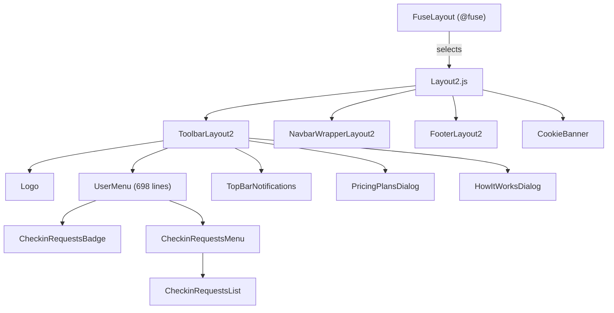

# Fuse Layouts Documentation

> **Directory:** `src/app/fuse-layouts/` · **Files:** 21
> **Purpose:** Application shell layout — toolbar, footer, navbar, and shared UI components used across all pages.

---

## Architecture Overview

---

## 1. Layout Registration

| File                   | Description                                          |
| ---------------------- | ---------------------------------------------------- |
| `FuseLayouts.js`       | Maps `{ layout2 }` — only one layout is registered   |
| `FuseLayoutConfigs.js` | Exports `Layout2Config` for settings form generation |

---

## 2. Layout2 — `layout2/Layout2.js` (165 lines)

Main application shell. Visibility of toolbar, navbar, and footer is **context-aware**:

| Condition                                              | Toolbar      | Footer                |
| ------------------------------------------------------ | ------------ | --------------------- |
| Session page (`/session/`, `/m_session`)               | Hidden       | Hidden                |
| Auto page (`/auto`)                                    | Hidden       | Hidden                |
| Web check-in (`/checkin`, `/quiz`, `/download`, `/w/`) | Hidden       | Hidden                |
| Home page (`/`)                                        | Hidden       | —                     |
| Blog/terms/pricing pages                               | Always shown | Hidden (blog), varies |
| Anonymous user                                         | Shown        | Hidden                |
| Mobile device                                          | —            | Hidden                |
| Authenticated, standard page                           | Shown        | Shown                 |

**Components rendered:** `ToolbarLayout2`, `NavbarWrapperLayout2`, `FooterLayout2`, `FuseScrollbars`, `FuseDialog`, `FuseMessage`, `ErrorToast`, `CookieBanner`

### Layout2Config — `layout2/Layout2Config.js` (105 lines)

| Setting     | Default        | Options                      |
| ----------- | -------------- | ---------------------------- |
| Mode        | `fullwidth`    | boxed, fullwidth, container  |
| Navbar      | Hidden         | display toggle               |
| Toolbar     | Shown, `below` | display toggle, above/below  |
| Footer      | Shown, `fixed` | display toggle, fixed/static |
| Side panels | Hidden         | —                            |

---

## 3. Layout2 Sub-Components — `layout2/components/`

### ToolbarLayout2 (245 lines)

Top application bar containing:

| Element                       | Condition                |
| ----------------------------- | ------------------------ |
| Logo                          | Always                   |
| Navbar mobile toggle          | `mdDown` only            |
| "Upgrade account" link        | Standard plan users only |
| Help icon (HowItWorks dialog) | Desktop only             |
| `<UserMenu>`                  | Desktop only             |
| `<TopBarNotifications>`       | Always                   |

**Dialogs managed:** PricingPlansDialog, ImportAttendeesExcelDialog, ImportGradingExcelDialog, HowItWorksDialog (language-aware, detects IL country code for Hebrew)

### Other Layout Components

| Component              | Lines | Description                                                  |
| ---------------------- | ----- | ------------------------------------------------------------ |
| `NavbarWrapperLayout2` | ~90   | Wraps NavbarLayout2 (desktop) + NavbarMobileLayout2 (drawer) |
| `NavbarLayout2`        | ~25   | Renders Navigation + UserNavbarHeader in scrollable panel    |
| `NavbarMobileLayout2`  | ~75   | Swipeable drawer variant of navbar                           |
| `FooterLayout2`        | ~190  | Footer with social links, powered-by info                    |
| `LeftSideLayout2`      | ~6    | Empty placeholder (`FuseSidePanel`)                          |

---

## 4. Shared Components — `shared-components/`

### UserMenu (698 lines) ⚠️ Largest shared component

Renders the user avatar button in the toolbar and a dropdown menu with role-dependent items:

| Guest menu     | Authenticated menu    |
| -------------- | --------------------- |
| Sign Up button | Avatar + display name |
| Login button   | My Courses            |
| —              | Billing               |
| —              | Settings              |
| —              | Contact Us            |
| —              | Logout                |

**Key features:**

- **Check-in requests:** Polls `getCheckinRequests()` every 30 seconds, renders `CheckinRequestsBadge` + `CheckinRequestsMenu`
- **Session timeout:** Auto-logout after inactivity period using `checkIfLoginTimeout()`
- **Admin/Host role switch:** `switchToAdmin()` / `switchToHost()` for multi-role users
- **Premium confirmation:** Shows `PremiumPlanConfirmationDialog` after payment
- **Referral code:** Reads from URL via `getDerivedStateFromProps`

### CheckinRequestsBadgeComponent (37 lines)

Notification bell icon with red badge showing pending check-in request count.

### CheckinRequestsMenuComponent (127 lines)

Popover listing pending late check-in requests with approve/deny actions.

| Feature                   | Description                                                       |
| ------------------------- | ----------------------------------------------------------------- |
| Approve all               | Batch approve (with confirmation)                                 |
| Individual approve/deny   | Per-request, handles both regular and "field" methods             |
| Group manager restriction | Checks `isDisabledForGroupManager` + `allow_approve_late_checkin` |

### CheckinRequestsList (110 lines)

Renders individual check-in request rows with student name, course, time, and approve/deny buttons.

### CookieBanner (150 lines)

GDPR cookie consent banner. Fixed to bottom, z-index 9999.

| User Type | Storage                            | Display Logic                                   |
| --------- | ---------------------------------- | ----------------------------------------------- |
| Guest     | `localStorage.cookiesAgreed`       | Show if not agreed                              |
| Host      | DB field `user.data.cookiesAgreed` | Show if not agreed AND not in session/auto page |

### Other Shared Components

| Component                  | Lines | Description                                                      |
| -------------------------- | ----- | ---------------------------------------------------------------- |
| `Logo`                     | 31    | ezCheckMe logo image (`logo.svg`, 45px height)                   |
| `Navigation`               | 25    | Thin wrapper around `FuseNavigation` with Redux navigation state |
| `UserNavbarHeader`         | 61    | Avatar + display name + email for the side navbar                |
| `SettingsPanel`            | 111   | Slide-in dialog with `FuseSettings` (rotating gear icon trigger) |
| `NavbarFoldedToggleButton` | ~35   | Toggle button for navbar folded state                            |
| `NavbarMobileToggleButton` | ~25   | Toggle button for navbar mobile drawer                           |
| `PurchaseButton`           | 21    | ⚠️ Fuse template leftover — links to ThemeForest purchase page   |
| `PoweredByLinks`           | 146KB | ⚠️ Extremely large file — likely contains embedded data/SVG      |

---

## 5. Rebuild Notes

> [!IMPORTANT]
> **Must preserve:**
>
> - Context-aware toolbar/footer visibility logic
> - Check-in requests polling and approve/deny workflow
> - Session timeout auto-logout
> - Cookie consent with dual storage (localStorage + DB)
> - Role-dependent menu items (guest vs host vs admin)

> [!WARNING]
> **Issues to address:**
>
> 1. `UserMenu.js` (698 lines) — needs decomposition into smaller components
> 2. `PoweredByLinks.js` (146KB) — investigate; likely embedded binary data that should be extracted
> 3. `PurchaseButton.js` — remove (Fuse template artifact)
> 4. `MobileDetect` usage in Layout2 — replace with CSS media queries
> 5. `ToolbarLayout2` manages 4 inline `<Dialog>` components — extract to separate dialog manager

> [!TIP]
> **Recommended improvements:**
>
> 1. Replace class-based `UserMenu` with functional component + hooks
> 2. Extract check-in request logic into a custom hook (`useCheckinRequests`)
> 3. Extract session timeout logic into a custom hook (`useSessionTimeout`)
> 4. Use React Context for dialog management instead of Redux + inline Dialogs
