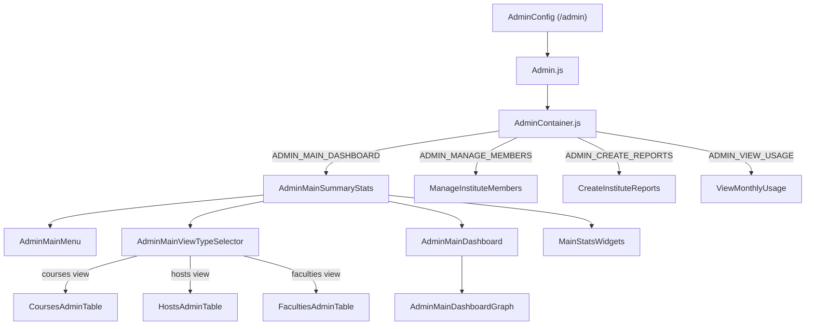

# Main Admin Module Documentation

> **Directory:** `src/app/main/admin/` · **Files:** 27
> **Purpose:** Institute/organization admin dashboard — aggregate analytics, faculty/course/host management, reports, and member management.

---

## Architecture Overview

---

## Route

- **Path:** `/admin`
- **Component:** `Admin` (lazy loaded)

---

## Components

### Shell

| File                | Lines | Description                                                                   |
| ------------------- | ----- | ----------------------------------------------------------------------------- |
| `Admin.js`          | ~30   | Wrapper with `Session` guard, renders `AdminContainer`                        |
| `AdminContainer.js` | 119   | View switcher (dashboard/members/reports/usage), loads initial stats on mount |

### Navigation & Controls

| File                           | Size  | Description                                                  |
| ------------------------------ | ----- | ------------------------------------------------------------ |
| `AdminMainMenu.js`             | 6.5KB | Left-side menu: Dashboard, Members, Reports, Monthly Usage   |
| `AdminMainViewTypeSelector.js` | 7.5KB | Toggle between Courses/Hosts/Faculties views with date range |

### Dashboard

| File                         | Size  | Description                                           |
| ---------------------------- | ----- | ----------------------------------------------------- |
| `AdminMainDashboard.js`      | ~25   | Dashboard wrapper                                     |
| `AdminMainDashboardGraph.js` | 11KB  | Chart.js line/bar graph showing attendance over time  |
| `AdminMainSummaryStats.js`   | 6.4KB | Summary stats layout container                        |
| `MainStatsWidgets.js`        | 3.5KB | Stat cards: total courses, hosts, sessions, check-ins |

### Data Tables

| File                          | Size  | Description                       |
| ----------------------------- | ----- | --------------------------------- |
| `CoursesAdminTable.js`        | 5.9KB | All courses with attendance stats |
| `HostsAdminTable.js`          | 5.1KB | All hosts with activity metrics   |
| `FacultiesAdminTable.js`      | 3.8KB | Faculty-level rollup              |
| `DownloadTableExcelReport.js` | 3.2KB | Export admin table to Excel       |

### Management

| File                        | Size  | Description                     |
| --------------------------- | ----- | ------------------------------- |
| `ManageInstituteMembers.js` | 5.7KB | Add/remove institute members    |
| `CreateInstituteReports.js` | 6.6KB | Generate institute-wide reports |
| `ViewMonthlyUsage.js`       | 4.3KB | Monthly usage breakdown         |

---

## Rebuild Notes

> [!IMPORTANT]
> **Must preserve:**
>
> - Admin impersonation flow — `impid || hostid` pattern from `EZDataService` must work identically
> - Faculty manager vs. institute admin role distinction — controls which views/actions are available
> - Date range filtering for aggregate stats (weekly/monthly/custom) — backend API accepts `from`/`to` params
> - Excel export format for admin tables — `DownloadTableExcelReport` generates host-facing reports
> - `AdminMainDashboardGraph` chart configuration — attendance trends line/bar chart with legend
> - View type switching (Courses / Hosts / Faculties) with preserved selection state

> [!WARNING]
>
> 1. `AdminContainer` is class-based — convert to functional
> 2. Faculty manager role check is scattered across `componentDidMount` — centralize
> 3. Admin Redux state (`data.admin`) is complex — document the expected shape
