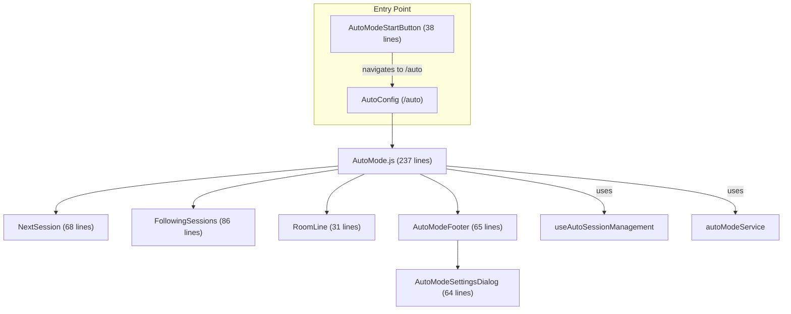
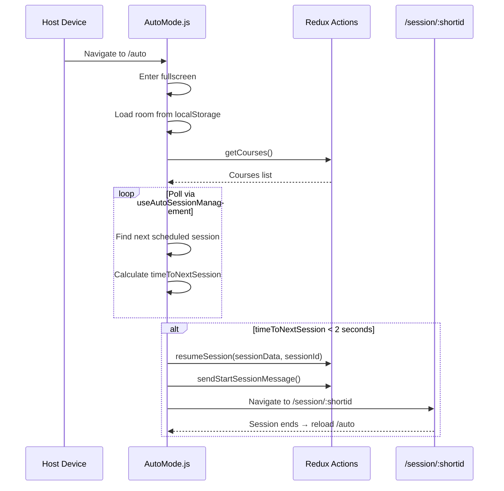

# Main Auto-Mode Module Documentation

> **Directory:** `src/app/main/auto/` · **Files:** 12 (6 components + 6 style files)
> **Purpose:** Unattended session runner — automatically starts and manages scheduled check-in sessions in fullscreen kiosk mode. Used in classrooms and labs where a dedicated device runs sessions hands-free.

---

## Architecture Overview

---

## 1. Route

- **Path:** `/auto`
- **Component:** `AutoMode` (lazy loaded via `@loadable/component`)
- **Entry:** `AutoModeStartButton` in `CourseDetails.js` (visible when `user.data.autoMode` is enabled)

---

## 2. AutoMode.js (237 lines) — Main Controller

Functional component using hooks. Orchestrates the auto-session lifecycle.

### Lifecycle

### Key Features

| Feature                | Description                                                        |
| ---------------------- | ------------------------------------------------------------------ |
| **Auto-start**         | Automatically starts sessions when `timeToNextSession < 2` seconds |
| **Room selection**     | Dropdown to select room (stored in `localStorage._room_`)          |
| **Next session**       | Displays next session with countdown timer and "Start Now" option  |
| **Following sessions** | Table showing up to 4 upcoming sessions sorted by start time       |
| **Fullscreen**         | Auto-enters fullscreen on mount                                    |
| **Theme support**      | Custom background color + logo from `user.data.theme`              |
| **RTL support**        | Language detection with RTL layout                                 |
| **Session reload**     | After session ends, reloads `/auto` via `reloadAfterSession()`     |
| **Tawk.to hiding**     | Hides support chat widget during auto-mode                         |

### Dependencies

| Dependency                 | Source        | Purpose                                |
| -------------------------- | ------------- | -------------------------------------- |
| `useAutoSessionManagement` | `hooks/`      | Session scheduling and timer logic     |
| `useFullScreen`            | `hooks/`      | Fullscreen API wrapper                 |
| `useLanguageDetection`     | `hooks/`      | RTL/locale detection                   |
| `useErrorHandler`          | `hooks/`      | Error handling wrapper                 |
| `autoModeService`          | `services/`   | Room storage, session finalize, reload |
| `courses.actions` (Redux)  | `data/store/` | getCourses, getCourseSessions, etc.    |

---

## 3. Sub-Components

### AutoModeStartButton (38 lines)

Entry point button rendered in `CourseDetails.js`. Stores `courseId` in `localStorage._course_id_` and navigates to `/auto`.

| Feature        | Description                                  |
| -------------- | -------------------------------------------- |
| Icon           | `BrightnessAutoIcon` (MUI)                   |
| Style          | Yellow background (`#f4b829`) with bold text |
| Disabled state | Controlled by `disabled` prop                |

### NextSession (68 lines)

Displays the next scheduled session with details and countdown.

| Field        | Source                                                                         |
| ------------ | ------------------------------------------------------------------------------ |
| Course name  | `nextSession.coursename`                                                       |
| Session name | `nextSession.name`                                                             |
| Start time   | `format(nextSession.begins, "HH:mm")`                                          |
| Countdown    | `CounterDown` component                                                        |
| Start Now    | Clickable link (hidden if `user.data.hideStartNowAutoSessionButton === false`) |

### FollowingSessions (86 lines)

MUI Table showing up to 4 upcoming sessions.

| Column             | Description                                     |
| ------------------ | ----------------------------------------------- |
| Course             | Course name                                     |
| Session            | Session name                                    |
| Date               | Localized date                                  |
| Time               | Localized time                                  |
| Disabled indicator | Red text if `isAutoModeDisabled(session.label)` |

### AutoModeFooter (65 lines)

Footer bar with logo, "Exit Auto Mode" link, settings gear icon, and fullscreen toggle.

### AutoModeSettingsDialog (64 lines)

Dialog to configure auto-mode session duration. Stores value in `localStorage._session_registration_length_`.

### RoomLine (31 lines)

Room selection dropdown using `RoomSelectionDropdown` component. Only renders when rooms are configured (`user.data.autoModeRooms`).

---

## 4. localStorage Keys

| Key                             | Purpose                        |
| ------------------------------- | ------------------------------ |
| `_room_`                        | Selected room for auto-mode    |
| `_course_id_`                   | Course ID for auto-mode entry  |
| `_session_registration_length_` | Configured session duration    |
| `_r_a_a_s_`                     | Reload-after-auto-session flag |

---

## 5. Rebuild Notes

> [!IMPORTANT]
> **Must preserve:**
>
> - Auto-start timing logic (`timeToNextSession < 2 seconds`)
> - Room selection and persistence (`_room_` localStorage key)
> - Session duration override (`_session_registration_length_`)
> - Post-session reload behavior (`reloadAfterSession`)
> - Tawk.to chat widget hide/show lifecycle
> - Disabled session detection via `isAutoModeDisabled(label)`
> - "Start Now" button visibility toggle (`hideStartNowAutoSessionButton`)

> [!WARNING]
> **Issues to address:**
>
> 1. Uses `withRouter` + `history.push` — replace with TanStack Router `navigate()`
> 2. `Formsy` used in `RoomLine` and `AutoModeSettingsDialog` — replace with React Hook Form
> 3. `withStyles` HOCs on all components — replace with Tailwind
> 4. Config hardcodes `config.categories.Academy` for icon quiz — should read from course settings
> 5. `FollowingSessions` hardcodes Hebrew locale for time display (`"he"`) — should use detected locale

> [!TIP]
> **Rebuild location:** Assign to **Phase 7** (Session Module) since auto-mode is tightly coupled to session lifecycle via `useAutoSessionManagement`, `resumeSession`, and `finalizeSession`.
