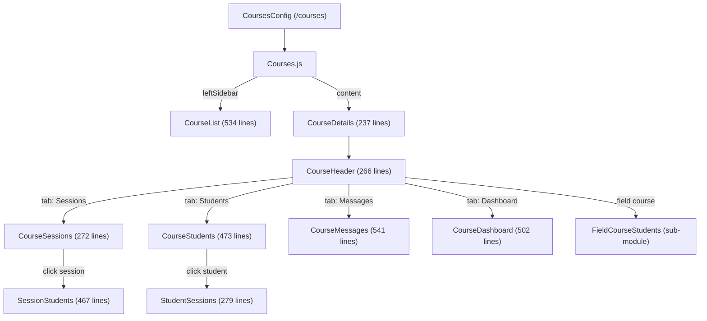

# Main Courses Module Documentation

> **Directory:** `src/app/main/courses/` · **Files:** 20 + 8 (fieldCourseStudents/)
> **Purpose:** Course management dashboard — the primary authenticated user experience. Lists courses, shows sessions, students, attendance analytics, and messaging.

---

## Architecture Overview

---

## 1. Route & Shell

### CoursesConfig.js (17 lines)

- Route: `/courses` → `Courses` (code-split via `@loadable/component`)

### Courses.js (44 lines)

- Wraps content in `<Session>` guard (redirects guests)
- Uses `FusePageSimple` with:
  - **Left sidebar:** `CourseList` (permanent)
  - **Content:** `CourseDetails` (lazy loaded)

---

## 2. Course List — `CourseList.js` (534 lines)

Sidebar component listing all host courses with full CRUD operations.

| Feature          | Description                                                                 |
| ---------------- | --------------------------------------------------------------------------- |
| New course       | Opens `NewCourseTypeDialog` → `EditCourseDialog` with course type selection |
| Edit course      | Inline edit via menu                                                        |
| Delete course    | Via `openDeleteCourseDialog` with confirmation                              |
| Status toggle    | Active/Paused/Hidden filter                                                 |
| Field check-in   | Detects field check-in courses via `isFieldCheckinCoursesEnabled`           |
| First-time UX    | Opens new course dialog automatically on first visit                        |
| Course selection | Dispatches `selectCourseById` → loads course data                           |
| Sort/filter      | Active + hidden toggle, hover menu per course                               |
| Custom hook      | Uses `useMenuAction` for menu interactions                                  |

**Redux:** reads `data.courses`, dispatches `getCourses`, `selectCourse`, `setCourseStatus`, `updateCourse`, `deleteCourse`

---

## 3. Course Details — `CourseDetails.js` (237 lines)

Main content area showing the selected course. Key features:

| Feature        | Description                                                    |
| -------------- | -------------------------------------------------------------- |
| Start Session  | Opens `StartSession` dialog (loadable)                         |
| Auto Mode      | Shows `AutoModeStartButton` if `user.data.autoMode` enabled    |
| QR Download    | Opens `CourseQrCodeDownload` dialog for field check-in courses |
| Resume Session | Handles `RESUME_SESSION` row action                            |
| ExcelJS        | Loaded via `scriptLoader` CDN in CourseHeader                  |

---

## 4. Course Header — `CourseHeader.js` (266 lines)

Tab navigation bar with course name and action buttons.

| Tab ID                   | Component Shown     | Description              |
| ------------------------ | ------------------- | ------------------------ |
| `COURSE_SESSIONS`        | CourseSessions      | Session list with search |
| `COURSE_STUDENTS`        | CourseStudents      | Student attendance grid  |
| `COURSE_MESSAGES`        | CourseMessages      | In-app messaging         |
| `COURSE_DASHBOARD`       | CourseDashboard     | Attendance analytics     |
| `STUDENT_FIELD_CHECKINS` | FieldCourseStudents | Field check-in data      |

**Features:** Excel report download (via `downloadFieldCourseExcelReport`), back navigation, tab persistence

---

## 5. Data Views

### CourseSessions (272 lines)

Sortable session table with columns: `#`, `name`, `label`, `sessionid`, `starts`, `checkins`, `attendance`.

| Menu Action     | Description                |
| --------------- | -------------------------- |
| Import sessions | Calendar-based import      |
| Delete sessions | Batch delete selected      |
| Rename session  | Single session rename      |
| Edit date/time  | Single session date edit   |
| Merge sessions  | Merge 2+ selected sessions |

### CourseStudents (473 lines)

Student attendance grid showing all students × all sessions with check-in status.

| Feature         | Description                                     |
| --------------- | ----------------------------------------------- |
| Manual check-in | Checkbox per student per session                |
| Search          | Filter students by name                         |
| Tooltip         | Shows check-in details (method, time, location) |
| Sortable        | Click column headers to sort                    |
| Context menu    | `CourseStudentsMenu` for batch actions          |

### SessionStudents (467 lines)

Per-session student list with detailed check-in information.

| Column   | Description                                       |
| -------- | ------------------------------------------------- |
| name     | Student name                                      |
| time     | Check-in timestamp                                |
| method   | Check-in method icon (QR, IVR, GPS, manual, etc.) |
| location | GPS location status                               |

### StudentSessions (279 lines)

Per-student view showing all sessions with attendance status. Includes student details (name, email, phone), navigation between students, and manual check-in toggle.

### CourseDashboard (502 lines)

Attendance analytics dashboard (premium feature with teaser for free plan).

| Card                      | Description                                           |
| ------------------------- | ----------------------------------------------------- |
| Course attendance rate    | Percentage with visual indicator                      |
| Last session rate         | Latest session attendance                             |
| Sessions attendance chart | Line/bar chart (Chart.js)                             |
| Attendees attendance      | Per-student breakdown                                 |
| Last missed sessions      | Students sorted by consecutive absences (color-coded) |
| Last session absentees    | Who missed the latest session                         |

### CourseMessages (541 lines)

In-app messaging system for sending notifications to course students.

| Feature         | Description                                      |
| --------------- | ------------------------------------------------ |
| New message     | Dialog with text input, sends to all students    |
| Message list    | Chronological list with sender, date, read count |
| Message details | Read/unread breakdown per student                |
| Delete          | With confirmation dialog                         |
| Read receipts   | Shows read/unread counts with student lists      |
| Premium gate    | `DownloadExcelReportTeaser` for free plan users  |

---

## 6. Field Course Students — `fieldCourseStudents/` (8 files)

Sub-module for field check-in courses (GPS/QR-based attendance without live sessions).

| File                             | Description                                     |
| -------------------------------- | ----------------------------------------------- |
| `FieldCourseStudents.js` (5.5KB) | Main component with data table and check-in bar |
| `FieldCheckinBar.js` (2.8KB)     | Status bar for field check-in progress          |
| `DataTable.js` (4.3KB)           | Student data grid for field courses             |
| `DataCell.js` (2KB)              | Individual data cell renderer                   |
| `DateCell.js` (1.5KB)            | Date-formatted cell                             |
| `StudentDataRow.js` (1.5KB)      | Student row component                           |
| `DatesRow.js`                    | Date header row                                 |

---

## 7. Supporting Components

| File                      | Lines | Description                                       |
| ------------------------- | ----- | ------------------------------------------------- |
| `CourseLine.js`           | 40    | Single course row in sidebar with color indicator |
| `CourseLineColor.js`      | 12    | Color dot indicator for course status             |
| `CourseHeaderTabs.js`     | ~100  | Tab bar renderer for CourseHeader                 |
| `CourseTableHeadCell.js`  | ~30   | Sortable table header cell                        |
| `CourseStudentsMenu.js`   | ~75   | Context menu for student batch operations         |
| `StudentFieldCheckins.js` | ~170  | Field check-in history per student                |

---

## 8. Rebuild Notes

> [!IMPORTANT]
> **Must preserve:**
>
> - Master-detail layout (sidebar course list + content area)
> - Tab-based navigation (Sessions/Students/Messages/Dashboard)
> - Manual check-in workflow
> - Session action menu (import/delete/rename/edit date/merge)
> - Attendance analytics calculations
> - Field check-in course variant
> - Message read receipts

> [!WARNING]
> **Issues to address:**
>
> 1. All major components are class-based — convert to functional + hooks
> 2. `CourseHeader.js` loads ExcelJS from CDN via `scriptLoader` HOC — bundle or lazy-load instead
> 3. `mapStateToProps` does `.find()` on courses array in every render — memoize with selectors
> 4. Several components exceed 400 lines — decompose
> 5. `CourseDashboard` calculates attendance in `componentDidUpdate` — extract to custom hook
