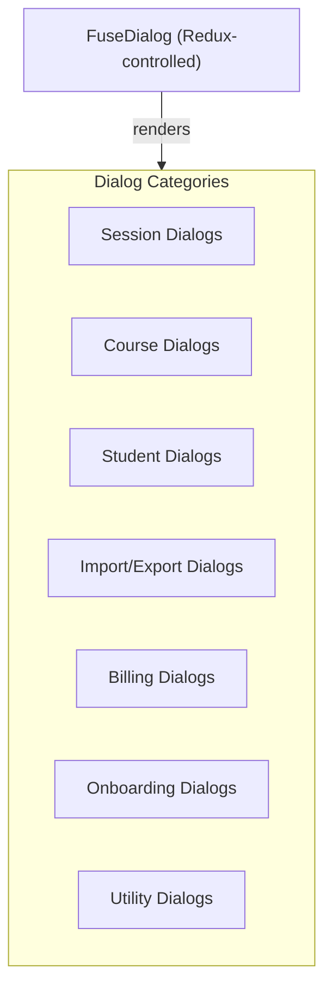
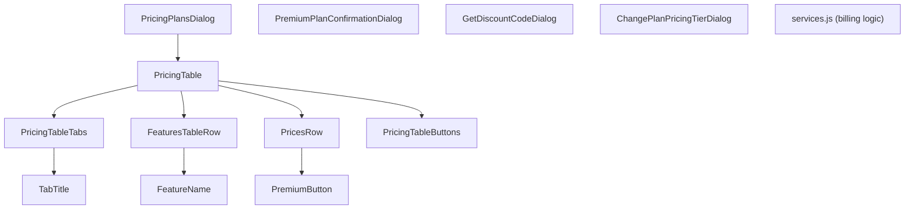

# Main Dialogs Module Documentation

> **Directory:** `src/app/main/dialogs/` · **Files:** 52 + 3 subdirectories (Billing: 17, UpdateUser: 4, howItWorks: 3)
> **Purpose:** All modal dialog components used across the application — session management, course editing, student management, billing, imports, and more.

---

## Architecture Overview

All dialogs are rendered via the global `FuseDialog` component, opened by dispatching `openDialog({ children: <DialogComponent /> })` to Redux.

---

## 1. Session Dialogs

### StartSession.js (582 lines) — ⚠️ Largest dialog

Pre-session configuration dialog opened before launching a live check-in session.

| Setting            | Options                                 |
| ------------------ | --------------------------------------- |
| Course selection   | Dropdown of active courses              |
| Duration           | Selectable time (default: 7 min)        |
| Quiz category      | Icon quiz categories (Academy, etc.)    |
| Icon Quiz checkbox | Enable/disable icon verification        |
| IVR                | Phone call check-in option              |
| Geofencing         | Location-based check-in restriction     |
| Language           | Session display language                |
| Start notification | Send notification to students           |
| Advanced options   | Collapsible section with extra settings |

### SessionDialogs.js (168 lines) — Factory Functions

Utility module exporting dialog opener functions (not a component itself):

| Function                         | Description                                         |
| -------------------------------- | --------------------------------------------------- |
| `openDeleteSessionDialog`        | Confirmation dialog for single/batch session delete |
| `openRenameSessionDialog`        | Session rename form                                 |
| `openEditSessionDateTimeDialog`  | Date/time editor for individual sessions            |
| `openMergeSessionsDialog`        | Merge 2+ selected sessions into one                 |
| `openImportSessionDialog`        | Import sessions from Excel                          |
| `openCreateFutureSessionsDialog` | Schedule future sessions                            |

### Supporting Components

| File                               | Lines | Description                   |
| ---------------------------------- | ----- | ----------------------------- |
| `RenameSession.js`                 | ~90   | Session rename form           |
| `EditSessionDateTime.js`           | ~75   | Date/time picker for sessions |
| `MergeSessionsDialog.js`           | ~300  | Merge sessions with preview   |
| `CreateFutureSessionsDialog.js`    | ~180  | Schedule recurring sessions   |
| `ImportSessionsFromExcelDialog.js` | ~300  | Excel-based session import    |

---

## 2. Course Dialogs

| File                        | Lines | Description                                                                                                                        |
| --------------------------- | ----- | ---------------------------------------------------------------------------------------------------------------------------------- |
| `UpdateCourseDialog.js`     | 560   | Course create/edit: name, faculty, year, term, IVR, icon quiz, geofencing, post-URL, session notifications, lock dynamic attendees |
| `NewCourseTypeDialog.js`    | ~150  | Course type selection (regular vs field check-in)                                                                                  |
| `SelectCourseTypeDialog.js` | —     | Alternative course type selector                                                                                                   |
| `LocationSetupDialog.js`    | ~300  | GPS location configuration for geofencing                                                                                          |
| `PostCheckInUrlDialog.js`   | ~85   | Configure post-check-in redirect URL                                                                                               |

---

## 3. Student Dialogs

| File                             | Lines | Description                                         |
| -------------------------------- | ----- | --------------------------------------------------- |
| `AddStudentToCourseDialog.js`    | ~430  | Add students: manual entry, Excel import, batch add |
| `EditStudentDialog.js`           | ~400  | Edit student details (name, email, phone, ID)       |
| `DeleteStudentsDialog.js`        | ~110  | Confirm batch student deletion                      |
| `ManualCheckIn.js`               | ~130  | Manual check-in dialog for hosts                    |
| `SendInstructionsToAttendees.js` | ~120  | Send setup instructions to students                 |

---

## 4. Import/Export Dialogs

| File                               | Lines | Description                                                     |
| ---------------------------------- | ----- | --------------------------------------------------------------- |
| `ImportAttendeesExcelDialog.js`    | ~410  | Import students from Excel: column mapping, preview, validation |
| `ImportGradingExcelDialog.js`      | ~320  | Import grades from Excel                                        |
| `ImportSessionsFromExcelDialog.js` | ~310  | Import session schedule from Excel                              |
| `DownloadReportGatewayDialog.js`   | ~130  | Gateway for downloading attendance reports                      |
| `DownloadExcelReportTeaser.js`     | ~150  | Premium feature teaser for Excel reports                        |

---

## 5. Billing Sub-Module — `Billing/` (17 files)

| File                               | Description                                |
| ---------------------------------- | ------------------------------------------ |
| `PricingPlansDialog.js`            | Main pricing dialog wrapper                |
| `PricingTable.js`                  | Feature comparison table                   |
| `PricingTableTabs.js`              | Monthly/Annual toggle tabs                 |
| `PricesRow.js`                     | Price display row with currency formatting |
| `FeaturesTableRow.js`              | Individual feature comparison row          |
| `PremiumButton.js`                 | Upgrade CTA button                         |
| `PremiumPlanConfirmationDialog.js` | Post-payment confirmation                  |
| `GetDiscountCodeDialog.js`         | Apply discount code form                   |
| `DiscountCodeDialog.js`            | Discount code input                        |
| `ChangePlanPricingTierDialog.js`   | Plan tier change                           |
| `services.js`                      | Billing service logic (4KB)                |

---

## 6. Update User — `UpdateUser/` (4 files)

| File                  | Description                                      |
| --------------------- | ------------------------------------------------ |
| `UpdateUserDialog.js` | Main user profile edit dialog (two-panel layout) |
| `LeftPanel.js`        | Avatar, name display                             |
| `RightPanel.js`       | Email, phone, password, settings                 |

---

## 7. Onboarding & Marketing Dialogs

| File                      | Lines | Description                              |
| ------------------------- | ----- | ---------------------------------------- |
| `FirstTimeIntroDialog.js` | ~85   | Welcome dialog for new users             |
| `SignupGatewayDialog.js`  | ~110  | Host/Attendee role selection gateway     |
| `CheckInMessageDialog.js` | ~200  | Pre-check-in info message for students   |
| `GetFreePremiumDialog.js` | ~150  | Referral program dialog for free premium |
| `HostUsageDialog.js`      | ~150  | Usage statistics for hosts               |
| `CoronaMessageDialog.js`  | ~90   | COVID-19 related notification            |
| `HowItWorksDialog.js`     | ~100  | Video explainer with language support    |
| `HowItWorksTabs.js`       | ~25   | Tab component for how-it-works sections  |

---

## 8. Admin Dialogs

| File                          | Lines | Description                           |
| ----------------------------- | ----- | ------------------------------------- |
| `InstituteMembersDialog.js`   | ~350  | Manage institute/organization members |
| `AddInstituteMemberDialog.js` | ~190  | Add new member to institute           |
| `JoinAdminGroupDialog.js`     | ~120  | Join an admin group                   |

---

## 9. Utility Dialogs

| File                     | Lines | Description                                   |
| ------------------------ | ----- | --------------------------------------------- |
| `Confirmation.js`        | ~40   | Generic confirmation (title, body, OK/Cancel) |
| `ConfirmationDialog.js`  | ~35   | Alternative confirmation wrapper              |
| `ContactForm.js`         | ~200  | Contact us form (with file attachment)        |
| `ContactUsDialog.js`     | ~30   | Wrapper for ContactForm in dialog             |
| `CountryCodeSelector.js` | ~55   | Phone country code dropdown                   |

---

## 10. Rebuild Notes

> [!IMPORTANT]
> **Must preserve:**
>
> - StartSession configuration options (duration, quiz, IVR, geofencing)
> - Excel import workflows (attendees, grading, sessions) with column mapping
> - Billing/pricing feature comparison table
> - All factory functions in `SessionDialogs.js` for consistent dialog opening

> [!WARNING]
> **Issues to address:**
>
> 1. All major dialogs are class-based — convert to functional + hooks
> 2. `StartSession.js` (582 lines) — decompose into sub-components
> 3. `UpdateCourseDialog.js` (560 lines) — decompose
> 4. Import dialogs share patterns — extract `ImportDialog` base component
> 5. `CoronaMessageDialog` — likely needs removal (outdated COVID notification)
> 6. Dialog pattern inconsistency: some use `FuseDialog` via Redux, others use inline `<Dialog>`
