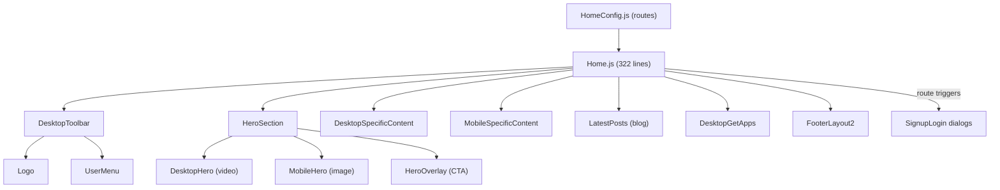

# Main Home Module Documentation

> **Directory:** `src/app/main/home/` · **Files:** 21
> **Purpose:** Public landing page, pricing, legal pages (Privacy, TOS, Accessibility, Cookies), and auth entry points.

---

## Architecture Overview



---

## 1. Routing — `HomeConfig.js` (37 lines)

All routes serve the same `Home` component (wrapped with `mobileRedirect`):

| Route                           | Purpose                         |
| ------------------------------- | ------------------------------- |
| `/home`                         | Default landing page            |
| `/login`                        | Opens login dialog              |
| `/signup`                       | Opens signup dialog             |
| `/forgot`                       | Opens forgot password dialog    |
| `/verify/:email/:code`          | Opens email verification dialog |
| `/verify-password/:email/:code` | Opens password change dialog    |

**Note:** The `Home` component also handles `/referral/:code` and `/session/:shortid/:code` via `match.params`.

---

## 2. Home.js (322 lines) — Main Landing Page

### Route-Based Dialog Triggers

Each route path triggers a `useEffect` that opens the corresponding `SignupLogin` dialog:

| Route                           | Dialog Type | Extra Behavior                  |
| ------------------------------- | ----------- | ------------------------------- |
| `/referral/:code`               | SIGNUP      | Extracts referral code from URL |
| `/verify/:email/:code`          | CONFIRM     | Calls `populateVerification()`  |
| `/verify-password/:email/:code` | CHANGE      | Opens password change form      |
| `/forgot`                       | FORGOT      | Calls `logoutUser()` first      |
| `/login`                        | LOGIN       | Only if user not logged in      |
| `/signup`                       | SIGNUP      | Only if user not logged in      |

### Redirect Logic

| Condition                                           | Redirect          |
| --------------------------------------------------- | ----------------- |
| Admin user (groupmanager or facultyManager)         | `/admin`          |
| Session redirect source (`/session/:shortid/:code`) | `/home`           |
| Authenticated user                                  | `/courses`        |
| Guest                                               | Stay on home page |

### Page Structure

```
┌─────────────────────────────────────┐
│ TopBarNotifications                  │
├─────────────────────────────────────┤
│ DesktopToolbar (hidden on mobile)   │
│  Logo │ Checking-in? │ How it works │
│       │ Pricing │ UserMenu           │
├─────────────────────────────────────┤
│ HeroSection                         │
│  Desktop: looping video background  │
│  Mobile: static webp/jpg image      │
│  Overlay: "Get Started" CTA button  │
├─────────────────────────────────────┤
│ Desktop: caption + LogosSlider      │
│ Mobile: checkin link + BookDemo +   │
│         "How does it work?" button  │
├─────────────────────────────────────┤
│ LatestPosts (blog feed)             │
├─────────────────────────────────────┤
│ DesktopGetApps (app store links)    │
├─────────────────────────────────────┤
│ Footer                              │
└─────────────────────────────────────┘
```

---

## 3. Sub-Components

### DesktopToolbar (90 lines)

Home page toolbar (hidden on mobile). Contains: Logo, "Checking-in?" link (opens check-in dialog), "How it works" (opens `HowItWorksDialog`), "Pricing" link, and `UserMenu`.

### HeroSection (44 lines)

Compositor that renders `DesktopHero` + `MobileHero` + `HeroOverlay`. Memoized with `React.memo`.

| Component                | Description                                                                        |
| ------------------------ | ---------------------------------------------------------------------------------- |
| `DesktopHero` (24 lines) | Looping autoplay muted video from CDN. Delayed render (7s `componentLoaded` timer) |
| `MobileHero` (24 lines)  | Static image with webp/jpg fallback from CDN                                       |
| `HeroOverlay` (23 lines) | "Get Started" CTA button that opens signup dialog                                  |

### DesktopSpecificContent (23 lines)

Caption text + `LogosSlider` (customer logos carousel). Desktop only.

### MobileSpecificContent (43 lines)

"Need to check-in?" link → `/w/checkin`, `BookDemo` component (lazy loaded), "How does it work?" play button.

### DesktopGetApps (50 lines)

App store download links (iOS + Android) with "Checking-in? Click here" link. Desktop only.

---

## 4. Legal / Info Pages

| Component       | Lines | Route            | Description                                                              |
| --------------- | ----- | ---------------- | ------------------------------------------------------------------------ |
| `Privacy`       | 39    | `/privacy`       | Privacy policy from `PrivacyHostText` asset                              |
| `Tos`           | 36    | `/terms`         | Terms of service from `TosHostText` asset                                |
| `Accessability` | 40    | `/accessibility` | Accessibility statement from `AccessabilityText` asset                   |
| `Cookies`       | ~500  | (dialog)         | Cookie policy rendered in `FuseDialog` via CookieBanner                  |
| `PrivacyDialog` | ~30   | (dialog)         | Privacy as dialog variant                                                |
| `TOSDialog`     | ~30   | (dialog)         | TOS as dialog variant                                                    |
| `Pricing`       | 41    | `/pricing`       | Renders `PricingPlansDialog` inline with "GET STARTED" button for guests |
| `Version`       | 13    | `/version`       | Shows app version number and date from config                            |

---

## 5. Utilities

### isMobileLayout (9 lines)

Returns `true` if `MobileDetect.phone()` or `window.innerWidth < 800`.

### Home.styles.js (200 lines)

Extensive CSS-in-JS styles for the home page including hero video sizing, overlay positioning, responsive breakpoints, and animation keyframes.

---

## 6. Rebuild Notes

> [!IMPORTANT]
> **Must preserve:**
>
> - Route-based auth dialog triggers (deep links for verify/forgot/referral)
> - Role-based redirect logic (admin/host/guest)
> - Desktop/mobile responsive split
> - App store download links
> - Legal page content (from asset text files)

> [!TIP]
> **Recommended improvements:**
>
> 1. Replace `MobileDetect` with CSS media queries + `useMediaQuery` hook
> 2. Replace `@loadable/component` with `React.lazy` + `Suspense`
> 3. Replace `window.location.href` navigation with React Router
> 4. Extract dialog trigger logic into a custom hook (`useAuthDialogs`)
> 5. Legal pages share identical structure — extract `LegalPage` wrapper component
> 6. Remove 7-second `componentLoaded` delay — use `<video onCanPlay>` instead
> 7. `document.title` set imperatively in legal pages — use `react-helmet` or route metadata
