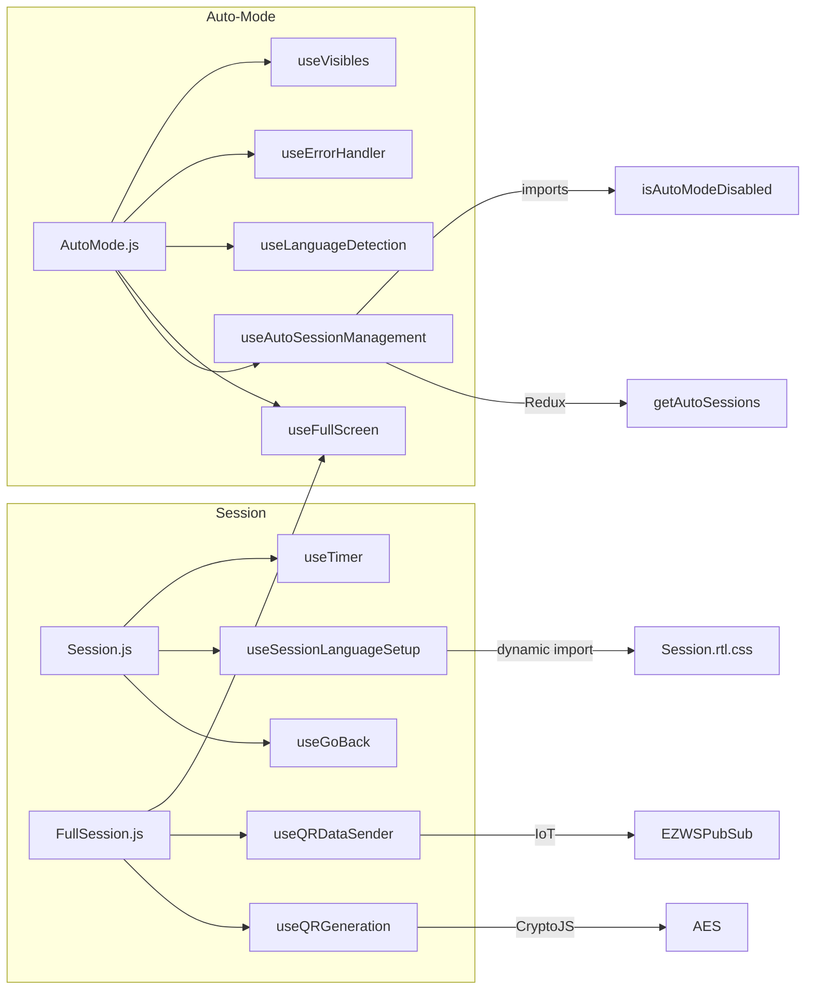

# Main Hooks Module Documentation

> **Directory:** `src/app/main/hooks/` · **Files:** 13
> **Purpose:** Shared custom React hooks used across multiple modules. These represent an initial migration step from class components to functional components.

---

## Hook Catalog

### Session Lifecycle Hooks

| Hook                                   | File                          | Lines | Used By       | Description                                                                                                                    |
| -------------------------------------- | ----------------------------- | ----- | ------------- | ------------------------------------------------------------------------------------------------------------------------------ |
| `useAutoSessionManagement`             | `useAutoSessionManagement.js` | 113   | `AutoMode.js` | Polls `getAutoSessions(room)` every 60s, finds next upcoming session, returns countdown timer                                  |
| `useGoBack`                            | `useGoBackFromSession.js`     | ~20   | `Session.js`  | After session ends, navigates to `/auto` or `/courses` with 1s delay                                                           |
| `useGoBack`, `useSessionLanguageSetup` | `useSessionHooks.js`          | 45    | `Session.js`  | Duplicate exports — `useGoBack` navigates based on `session.mode`, `useSessionLanguageSetup` handles language + RTL CSS import |
| `useTimer`                             | `useTimer.js`                 | ~30   | `Session.js`  | Session countdown timer                                                                                                        |

### QR Code Hooks

| Hook              | File                 | Lines | Used By          | Description                                                        |
| ----------------- | -------------------- | ----- | ---------------- | ------------------------------------------------------------------ |
| `useQRGeneration` | `useQRGeneration.js` | ~40   | `FullSession.js` | Generates rotating QR code images using CryptoJS AES encryption    |
| `useQRDataSender` | `useQRDataSender.js` | ~30   | `FullSession.js` | Publishes QR data via `EZWSPubSub` IoT WebSocket to mobile clients |

### UI Hooks

| Hook                                | File               | Lines | Used By                         | Description                                                     |
| ----------------------------------- | ------------------ | ----- | ------------------------------- | --------------------------------------------------------------- |
| `useFullScreen`                     | `useFullScreen.js` | ~20   | `AutoMode.js`, `FullSession.js` | Fullscreen API wrapper (`requestFullscreen` / `exitFullscreen`) |
| `useOnScreen` (alias `useVisibles`) | `useVisibles.js`   | ~20   | `AutoMode.js`                   | `IntersectionObserver` hook — returns `[ref, isVisible]`        |
| `useMenuAction`                     | `useMenuAction.js` | ~15   | `CourseDetails.js`              | Anchored menu open/close state                                  |

### Data Hooks

| Hook                   | File                      | Lines | Used By                     | Description                                                                  |
| ---------------------- | ------------------------- | ----- | --------------------------- | ---------------------------------------------------------------------------- |
| `useLanguageDetection` | `useLanguageDetection.js` | ~30   | `AutoMode.js`, `Session.js` | Detects user/course/session language, returns `{ isRtl, locale, direction }` |
| `useErrorHandler`      | `useErrorHandler.js`      | ~15   | `AutoMode.js`               | Error logging + toast notification wrapper                                   |
| `useTemplates`         | `useTemplates.js`         | ~40   | `Templates` component       | Session/course template CRUD via Redux dispatch                              |

---

## Dependency Graph

---

## Known Issues

> [!WARNING]
>
> 1. **Duplicate exports:** `useGoBack` exists in both `useGoBackFromSession.js` and `useSessionHooks.js` — consolidate to one file
> 2. **`useSessionLanguageSetup`** exists in both `useSessionHooks.js` and `useSessionLanguageSetup.js` — verify which is used, delete the other
> 3. **Incomplete extraction:** `useTimer`, `useQRGeneration`, `useQRDataSender` hooks are defined but may not be fully integrated into `Session.js` (the class component still has inline timer/QR logic)
> 4. **No TypeScript:** All hooks lack type definitions — add types during rebuild
> 5. **Missing tests:** No test files exist for any hook

---

## Rebuild Notes

> [!IMPORTANT]
> **Must preserve:**
>
> - `useAutoSessionManagement` — 60s polling interval + countdown logic + `isAutoModeDisabled` check
> - `useQRGeneration` — CryptoJS AES encryption with key `ezinfo007`
> - `useQRDataSender` — IoT pub/sub via `EZWSPubSub`
> - `useLanguageDetection` — RTL detection for Hebrew locale
> - `useFullScreen` — Fullscreen API with browser compatibility

> [!TIP]
> **Rebuild improvements:**
>
> 1. Consolidate duplicates: merge `useGoBack` + `useSessionLanguageSetup` into single canonical files
> 2. Add TypeScript generics and return types to all hooks
> 3. Replace `useHistory` (React Router v5) with `useNavigate` (TanStack Router)
> 4. Replace Redux `useDispatch`/`useSelector` with TanStack Query hooks where applicable
> 5. Add unit tests with `@testing-library/react-hooks` for each hook
