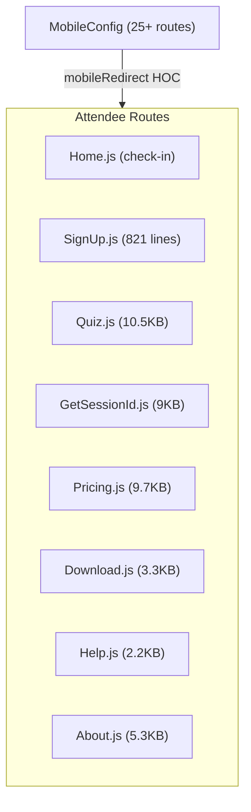

# Main Mobile Module Documentation

> **Directory:** `src/app/main/mobile/` · **Files:** 18 + 2 subdirectories
> **Purpose:** Attendee-side (student) mobile experience — check-in, signup, quiz, pricing, help.

---

## Architecture Overview

---

## Routing

The `MobileConfig.js` defines 25+ attendee-facing routes using the `mobileRedirect` HOC (which conditionally redirects mobile users or shows the desktop variant).

| Route                                  | Component                   | Description                          |
| -------------------------------------- | --------------------------- | ------------------------------------ |
| `/checkin/:shortid/:code/:icon`        | Home                        | QR-based check-in (main entry point) |
| `/checkin`                             | Home                        | Manual check-in                      |
| `/quiz/:shortid`                       | Quiz                        | Icon quiz verification               |
| `/sessionlogin`                        | SignUp                      | Attendee registration                |
| `/getsessionid`                        | GetSessionId                | Manual session ID entry              |
| `/download`                            | Download                    | App download page                    |
| `/pricing`                             | Mobile/Desktop Pricing      | Plan comparison                      |
| `/blog`, `/blog/:id`                   | Post/Posts                  | Blog content                         |
| `/terms`, `/privacy`                   | Tos/Privacy                 | Legal pages                          |
| `/attendee/terms`, `/attendee/privacy` | TosAttendee/PrivacyAttendee | Attendee-specific legal              |
| `/m_session`                           | MinimizedSession            | Minimized session popup              |
| `/w/help`                              | Help                        | Help page                            |
| `/WhatVersion`                         | Version                     | Version info                         |
| `/hosts_by_activity`                   | HostsActivity               | Super admin: host activity           |
| `/attendees_by_domain`                 | AttendeesByDomain           | Super admin: attendee domains        |

---

## Key Components

### SignUp.js (821 lines) — Attendee Registration

The largest mobile component. Multi-step registration flow:

| Step | Description                                                           |
| ---- | --------------------------------------------------------------------- |
| 1    | Enter details: phone/email toggle, first name, last name, attendee ID |
| 2    | SMS/email verification code                                           |
| 3    | Confirmed → redirects to quiz                                         |

**Features:** Country code selector, phone cookie persistence, resend code countdown (60s), email/phone dual-mode, error handling

### Quiz.js (10.5KB)

Icon quiz verification — student identifies the correct icon displayed in the QR code:

- Presents icon grid from the session's quiz category
- Student taps the matching icon
- Verifies against the server
- Success → check-in recorded

### Home.js (9.4KB) / GetSessionId.js (9KB)

Mobile check-in entry: enter session ID manually or via QR redirect.

### Pricing.js (9.7KB)

Mobile pricing page with plan comparison and upgrade flow.

---

## Subdirectories

| Directory            | Files | Description                          |
| -------------------- | ----- | ------------------------------------ |
| `ConfirmConditions/` | 4     | Terms & conditions confirmation flow |
| `CountryCodesModal/` | 2     | Phone country code selection modal   |

---

## Rebuild Notes

> [!IMPORTANT]
> The mobile check-in flow is the public-facing, student-side experience.
> Flow: QR scan → `/checkin/:shortid/:code/:icon` → SignUp (if new) → Quiz → Check-in recorded

> [!WARNING]
>
> 1. `SignUp.js` at 821 lines is the largest mobile component — decompose
> 2. `mobileRedirect` HOC should be replaced with responsive design
> 3. `/w/` prefix routes appear to be web-specific variants — unclear purpose
