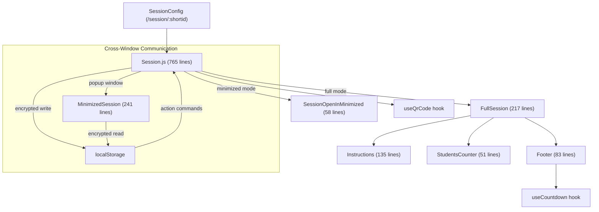
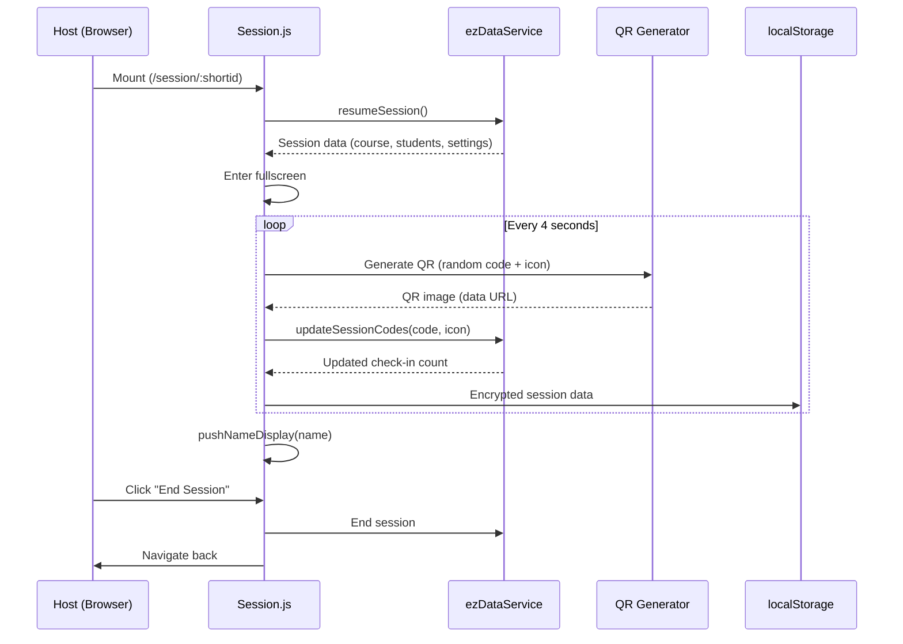

# Main Session Module Documentation

> **Directory:** `src/app/main/Session/` · **Files:** 14 + 2 hooks
> **Purpose:** Live attendance check-in session — the core feature. Displays a rotating QR code for students to scan, tracks check-ins in real-time with animated name displays, and supports fullscreen/minimized modes.

---

## Architecture Overview



---

## 1. Route

- **Path:** `/session/:shortid`
- **Component:** `Session` (lazy loaded via `@loadable/component`)

---

## 2. Session.js (765 lines) — Main Controller

The core business logic component orchestrating the live check-in session.

### Lifecycle



### Key Features

| Feature             | Description                                                                          |
| ------------------- | ------------------------------------------------------------------------------------ |
| **QR rotation**     | Every `QR_INTERVAL` (4s), generates new 6-digit code + random icon from 36-icon pool |
| **QR generation**   | Uses `qr-logo` library to embed quiz icons into QR codes (800px)                     |
| **Name display**    | Animated student name popup when check-in is received (with queue)                   |
| **Student counter** | Real-time `CountUp` animation showing total check-ins                                |
| **Fullscreen**      | Auto-enters fullscreen on mount                                                      |
| **Minimized mode**  | Opens popup window, communicates via encrypted localStorage                          |
| **Session timing**  | Countdown timer, auto-ends at 0                                                      |
| **Theme support**   | Custom background color + logo from session theme                                    |
| **RTL support**     | Hebrew language detection for right-to-left layout                                   |
| **IVR support**     | Shows IVR call instructions when enabled                                             |

### Cross-Window Communication

The full session and minimized popup communicate via encrypted localStorage:

| Channel            | Direction        | Data                                                                                  |
| ------------------ | ---------------- | ------------------------------------------------------------------------------------- |
| `_session_info_`   | Full → Minimized | QR image, remaining time, session ID, check-in count (CryptoJS AES, key: `ezinfo007`) |
| `_session_action_` | Minimized → Full | Actions: `end_session`, `close_minimized`                                             |

---

## 3. Display Modes

### FullSession.js (217 lines)

Full-screen session layout when QR is displayed in the main window.

```
┌──────────────────────────────────────────┐
│  Theme Logo (optional)                    │
│  Course Name / Session Name              │
│                                          │
│  ┌─────────────────┐  ┌──────────────┐  │
│  │ Instructions     │  │              │  │
│  │ "Scan or go to:" │  │   QR CODE    │  │
│  │   GoEZ.me        │  │   (800px)    │  │
│  │ Session ID: XXX  │  │              │  │
│  │ (IVR if enabled) │  └──────────────┘  │
│  └─────────────────┘                     │
│  ┌──────────────────────────────────────┐│
│  │ Animated: "John Doe checked in!" ▸   ││
│  │ 15 students checked in              ││
│  └──────────────────────────────────────┘│
├──────────────────────────────────────────┤
│  Logo │ Timer │ End Session │ ⛶ │ ▬    │
└──────────────────────────────────────────┘
```

### MinimizedSession.js (241 lines)

Separate popup window (class-based). Reads encrypted data from localStorage every 500ms.

| Feature          | Description                             |
| ---------------- | --------------------------------------- |
| Auto-resize      | Maintains 1.5:1 height/width ratio      |
| Auto-close       | Closes if no data updates for 10 cycles |
| Responsive fonts | Font sizes scale with window width      |
| Actions          | End session, maximize (back to full)    |

### SessionOpenInMinimized.js (58 lines)

Placeholder shown in the main window when session runs in minimized popup. Shows options to pop-up again or close minimized. Plays muted audio to prevent browser tab suspension.

---

## 4. Sub-Components

| Component          | Lines | Description                                                                                                                                                                |
| ------------------ | ----- | -------------------------------------------------------------------------------------------------------------------------------------------------------------------------- |
| `Instructions`     | 135   | Check-in instructions panel: icon quiz mode ("Scan or go to GoEZ.me") vs. no-quiz mode ("Scan using the EZCheck.me App"). RTL-aware. Shows Session ID and IVR instructions |
| `Footer`           | 83    | Session footer: logo, countdown timer, end session button, fullscreen toggle, minimize button. Uses `useCountdown` hook                                                    |
| `StudentsCounter`  | 51    | Animated check-in counter with bounce-in name display. Updates localStorage with current count                                                                             |
| `QrCode.js`        | ~15   | Basic QR wrapper                                                                                                                                                           |
| `SessionQrCode.js` | ~15   | Session-specific QR wrapper                                                                                                                                                |

---

## 5. Custom Hooks

### useCountdown (54 lines)

Countdown timer that auto-ends session at 0.

| Input                        | Output           |
| ---------------------------- | ---------------- |
| `initialRemaining` (seconds) | `remaining` (ms) |

Also writes remaining time to localStorage and reads action commands from minimized window.

### useQrCode (99 lines)

Generates rotating QR codes with embedded quiz icons.

| Flow      | Description                                            |
| --------- | ------------------------------------------------------ |
| Timer     | Fires every `QR_INTERVAL` seconds                      |
| Generate  | Random 6-digit code + random icon (1-36) from category |
| QR encode | `QRLogo.generate()` with error correction H, no margin |
| API sync  | `updateSessionCodes()` to register code on server      |
| Storage   | Writes QR image to localStorage for minimized window   |

---

## 6. Rebuild Notes

> [!IMPORTANT]
> **Must preserve:**
>
> - QR code rotation with server-side code registration
> - Cross-window communication (full ↔ minimized)
> - Real-time check-in name display with animation
> - Icon quiz verification system (36-icon pool per category)
> - RTL/Hebrew language support
> - Session theming (custom colors/logos)

> [!WARNING]
> **Issues to address:**
>
> 1. `Session.js` (765 lines) — massive class component, needs decomposition
> 2. CryptoJS with hardcoded key `"ezinfo007"` — security concern
> 3. Cross-window via localStorage polling is fragile — use `BroadcastChannel` API instead
> 4. `MinimizedSession` polls every 500ms — use event-driven approach
> 5. CDN-loaded ExcelJS script in CourseHeader creates dependency
> 6. `window.resizeBy()` in MinimizedSession — may not work in modern browsers
