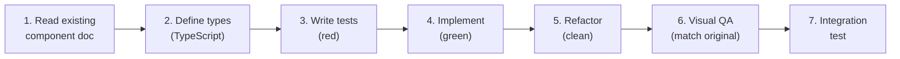

# ezCheckMe: TDD Rebuild Plan

> **Goal:** Rebuild the ezCheckMe web host from scratch using modern React 19 + shadcn/ui with test-driven development, maintaining visually identical UI and identical API surface.

---

## 1. Target Tech Stack

| Layer             | Current                     | Target                              | Rationale                                       |
| ----------------- | --------------------------- | ----------------------------------- | ----------------------------------------------- |
| **Runtime**       | React 16.8.5                | React 19                            | Latest stable, Server Components ready          |
| **Language**      | JavaScript                  | TypeScript                          | Type safety, refactor confidence                |
| **Build**         | CRA 3 + react-app-rewired   | Vite 6                              | 10x faster builds, native ESM                   |
| **UI Components** | MUI v4 + Fuse React 2.2.5   | **shadcn/ui** (Radix UI primitives) | Drop Fuse & MUI entirely — own the components   |
| **Styling**       | MUI withStyles + makeStyles | **Tailwind CSS 4**                  | Utility-first, co-located, no runtime CSS-in-JS |
| **State**         | Redux + redux-thunk         | Zustand + TanStack Query            | Simpler, less boilerplate, built-in cache       |
| **Routing**       | react-router-dom 5          | TanStack Router                     | Type-safe, file-based, loaders                  |
| **Forms**         | Manual state + Formsy       | React Hook Form + Zod               | Validation, performance                         |
| **Auth**          | aws-amplify 3               | aws-amplify 6                       | Modern Cognito API                              |
| **HTTP**          | Amplify API + axios         | TanStack Query + fetch              | Caching, deduplication, loading states          |
| **i18n**          | react-i18next               | react-i18next (keep)                | Works well, no reason to change                 |
| **Charts**        | Chart.js 2                  | Recharts                            | React-native, declarative                       |
| **PDF**           | @react-pdf/renderer 2       | @react-pdf/renderer 4               | Latest version                                  |
| **QR**            | qr-logo                     | qr-logo (keep)                      | Niche library, works                            |
| **Testing**       | ❌ None                     | Vitest + RTL + Playwright           | Full pyramid                                    |

> [!IMPORTANT]
> **Why shadcn/ui over MUI?**
>
> - **You own the code** — shadcn copies components into your project, no black-box dependency
> - **Tailwind CSS** — utility-first, zero runtime overhead, easier to match exact designs
> - **Radix UI primitives** — accessible, unstyled, composable (Dialog, Popover, Select, etc.)
> - **Smaller bundle** — no MUI runtime, no Emotion, no JSS
> - **Full control** — every pixel is yours to customize

---

## 2. Testing Framework & Infrastructure

### Test Pyramid

```
        ╱  E2E  ╲         Playwright (5-10 critical flows)
       ╱─────────╲
      ╱ Integration╲      Vitest + MSW (API mocking)
     ╱───────────────╲
    ╱   Component      ╲   Vitest + React Testing Library
   ╱─────────────────────╲
  ╱       Unit             ╲  Vitest (pure functions, hooks)
 ╱───────────────────────────╲
```

### Tools

| Tool                          | Purpose                                                             |
| ----------------------------- | ------------------------------------------------------------------- |
| **Vitest**                    | Unit + component + integration tests (Jest-compatible, Vite-native) |
| **React Testing Library**     | Component rendering, user-interaction testing                       |
| **MSW** (Mock Service Worker) | API mocking at network level (replaces manual mocks)                |
| **Playwright**                | E2E browser tests for critical user journeys                        |
| **Storybook**                 | Component development + visual regression                           |
| **Chromatic** (optional)      | Visual regression CI                                                |

### Test File Convention

```
src/
├── features/courses/
│   ├── CourseList.tsx
│   ├── CourseList.test.tsx        ← Component test
│   ├── CourseList.stories.tsx     ← Storybook
│   ├── useCourses.ts
│   └── useCourses.test.ts        ← Hook test
├── services/
│   ├── courseService.ts
│   └── courseService.test.ts     ← Unit test
└── e2e/
    ├── auth.spec.ts              ← E2E
    ├── courses.spec.ts
    └── session.spec.ts
```

### Coverage Targets

| Layer       | Min Coverage | Notes                                 |
| ----------- | :----------: | ------------------------------------- |
| Services    |     90%      | Pure functions, easy to test          |
| Hooks/State |     85%      | Business logic                        |
| Components  |     75%      | Focus on behavior, not implementation |
| E2E         |      —       | Cover 5-10 critical flows             |

---

## 3. New Project Structure

```
src/
├── app/
│   ├── layout.tsx                  ← Root layout (replaces Fuse Layout2)
│   └── routes.tsx                  ← TanStack Router config
│
├── features/                       ← Feature-based modules
│   ├── auth/
│   │   ├── components/            ← LoginDialog, SignupDialog, etc.
│   │   ├── hooks/                 ← useAuth, useSession
│   │   ├── services/              ← cognitoService.ts
│   │   └── store/                 ← authStore.ts (Zustand)
│   │
│   ├── courses/
│   │   ├── components/            ← CourseList, CourseDetails, etc.
│   │   ├── hooks/                 ← useCourses, useCourseStudents
│   │   ├── services/              ← courseService.ts
│   │   └── types/                 ← course.types.ts
│   │
│   ├── sessions/
│   │   ├── components/            ← FullSession, QrDisplay, etc.
│   │   ├── hooks/                 ← useQrCode, useCountdown
│   │   └── services/              ← sessionService.ts
│   │
│   ├── admin/
│   ├── messaging/
│   └── billing/
│
├── shared/
│   ├── components/                ← SortableTable, ButtonWithLoader, etc.
│   ├── hooks/                     ← useFullScreen, useMenuAction
│   ├── services/                  ← ezdataservice.ts (API client)
│   ├── types/                     ← Shared TypeScript types
│   └── utils/                     ← dateServices, formatters
│
├── components/ui/                  ← shadcn/ui components (Button, Dialog, Table, etc.)
├── config/                         ← Environment config (replaces config.js)
├── i18n/                           ← Translations (keep existing)
├── lib/                            ← Utility functions (cn(), etc.)
└── styles/                         ← tailwind.css, global theme, CSS variables
```

---

## 4. Module Migration Order

Bottom-up: dependencies first, features last.

```mermaid
gantt
    title Migration Order
    dateFormat X
    axisFormat %s

    section Foundation
    Config + Types         :f1, 0, 1
    API Client (ezdataservice)  :f2, 1, 2
    Services Layer         :f3, 2, 3
    Shared Utils           :f4, 2, 3

    section State
    Zustand Stores         :s1, 3, 4
    TanStack Query Setup   :s2, 3, 4

    section Auth
    Cognito + Auth Flow    :a1, 4, 5

    section Shell
    Layout + Toolbar       :l1, 5, 6
    Routing + Navigation   :l2, 5, 6

    section Shared UI
    Shared Components      :u1, 6, 7

    section Features
    Courses Module         :c1, 7, 9
    Session Module         :c2, 9, 11
    Admin Module           :c3, 11, 12
    Mobile Attendee        :c4, 12, 13

    section Dialogs
    All Dialogs            :d1, 13, 15
```



### Phase Details

#### Phase 1: Foundation (Week 1-2)

| Module                             | Files                                             | Test Strategy                    |
| ---------------------------------- | ------------------------------------------------- | -------------------------------- |
| `config/`                          | Environment config, feature flags                 | Unit: validate all env configs   |
| `shared/types/`                    | TypeScript interfaces for all domain models       | Compile-time checks              |
| `shared/services/ezdataservice.ts` | API client (replaces `ezdataservice.js`)          | Unit: all API methods with MSW   |
| `shared/services/`                 | courseService, sessionService, adminService, etc. | Unit: 90%+ coverage              |
| `shared/utils/`                    | dateServices, formatters, validators              | Unit: pure functions, edge cases |

##### Environment Configuration

The current `config.js` (347 lines) uses `process.env.REACT_APP_DIST_ENV` to switch between 3 environments. In the rebuild, replace with Vite `.env` files:

| Current (`config.js`)        | Vite Equivalent                 | Values                                                                                                                     |
| ---------------------------- | ------------------------------- | -------------------------------------------------------------------------------------------------------------------------- |
| `apiGateway.URL`             | `VITE_API_URL`                  | dev: `h92rez0gq8...amazonaws.com/dev` · qa: `6e5hy2ad2g...amazonaws.com/staging` · prod: `li5e8klng1...amazonaws.com/prod` |
| `cognito.USER_POOL_ID`       | `VITE_COGNITO_POOL_ID`          | Region-specific per environment                                                                                            |
| `cognito.APP_CLIENT_ID`      | `VITE_COGNITO_CLIENT_ID`        | Per environment                                                                                                            |
| `cognito.IDENTITY_POOL_ID`   | `VITE_COGNITO_IDENTITY_POOL_ID` | Per environment                                                                                                            |
| `session.IOT_DOMAIN`         | `VITE_IOT_DOMAIN`               | `a7aku5mzf9gel-ats.iot.us-east-2.amazonaws.com`                                                                            |
| `blog.API_URL`               | `VITE_BLOG_API_URL`             | `https://postsapi.ezcheck.me/wp-json/wp/v2`                                                                                |
| `general.HOST_URL`           | `VITE_HOST_URL`                 | dev/qa/prod domains                                                                                                        |
| `googleMapsApi.MAPS_API_KEY` | `VITE_GOOGLE_MAPS_KEY`          | API key                                                                                                                    |

Feature flags from `user.data` (not config):

- `user.data.autoMode` — enables auto-mode button
- `user.data.useGeofencing` — enables GPS check-in
- `user.data.hideStartNowAutoSessionButton` — hides manual start in auto-mode
- `user.data.autoModeRooms` — room list for auto-mode

#### Phase 2: State Management (Week 2-3)

| Module        | Current                          | Target                    | Test Strategy               |
| ------------- | -------------------------------- | ------------------------- | --------------------------- |
| Course store  | Redux actions/reducers (7 files) | Zustand `useCourseStore`  | Unit: state transitions     |
| Session store | Redux actions/reducers           | Zustand `useSessionStore` | Unit: session lifecycle     |
| Admin store   | Redux admin actions/reducers     | Zustand `useAdminStore`   | Unit: stats aggregation     |
| Auth store    | Redux auth actions/reducers      | Zustand `useAuthStore`    | Unit: auth state machine    |
| API cache     | Manual Redux state               | TanStack Query            | Integration: cache behavior |

#### Phase 3: Auth (Week 3-4)

| Component      | Current                    | Target                          | Tests                        |
| -------------- | -------------------------- | ------------------------------- | ---------------------------- |
| Auth bootstrap | `Auth.js` (class, Cognito) | `AuthProvider.tsx` (hook-based) | Integration: full auth flow  |
| Login/Signup   | 5-state dialog (class)     | `AuthDialog.tsx` (functional)   | Component: each state        |
| Session guard  | `Session` HOC              | `ProtectedRoute` component      | Component: redirect behavior |

#### Phase 4: Shell & Layout (Week 4-5)

| Component     | Current                      | Target (shadcn)                                     | Tests                             |
| ------------- | ---------------------------- | --------------------------------------------------- | --------------------------------- |
| Layout        | Fuse `Layout2` (165 lines)   | Custom `AppLayout.tsx` + Tailwind                   | Component: responsive breakpoints |
| Toolbar       | `ToolbarLayout2` (245 lines) | `AppToolbar.tsx` + shadcn `NavigationMenu`          | Component: user menu, actions     |
| Navigation    | Fuse navbar                  | shadcn `Sheet` (mobile) + sidebar (desktop)         | Component: route highlighting     |
| UserMenu      | `UserMenu.js` (698 lines)    | `UserMenu.tsx` (~200 lines) + shadcn `DropdownMenu` | Component: menu actions           |
| Cookie Banner | `CookieBanner.js`            | `CookieBanner.tsx` + shadcn `Alert`                 | Component: consent flow           |

#### Phase 5: Shared Components + Storybook (Week 5-6)

Set up Storybook during this phase as the visual QA workbench:

- Install Storybook with Vite builder (`npx storybook@latest init`)
- Create stories for every shared component as they are rebuilt
- Use stories for the per-component visual QA loop described in §9

| Component             | Current Size | shadcn Equivalent                   | Notes                                   |
| --------------------- | :----------: | ----------------------------------- | --------------------------------------- |
| SortableTable         |     13KB     | shadcn `DataTable` (TanStack Table) | Built-in sorting, filtering, pagination |
| ButtonWithLoader      |    2.2KB     | shadcn `Button` + loading variant   | Tailwind `animate-spin`                 |
| CheckinMethod         |    2.3KB     | Custom + Lucide icons               | Icon mapping component                  |
| DateRange             |    2.1KB     | shadcn `Calendar` + `Popover`       | date-fns integration                    |
| SearchComponent       |    1.5KB     | shadcn `Input` + debounce           | Straightforward                         |
| Confirmation          |  ~40 lines   | shadcn `AlertDialog`                | Direct replacement                      |
| Tooltips              |    varies    | shadcn `Tooltip`                    | Radix tooltip primitive                 |
| Dropdowns             |    varies    | shadcn `Select` / `Command`         | Combobox for searchable                 |
| _74 components total_ |              |                                     | Most map to shadcn primitives           |

#### Phase 6: Course Module (Week 7-9) — **Largest feature**

| Component                   | Current                      | Decomposition Plan                                     |
| --------------------------- | ---------------------------- | ------------------------------------------------------ |
| CourseList (534 lines)      | Class + Redux                | `CourseList` + `CourseItem` + `useCourses` hook        |
| CourseDashboard (502 lines) | Class, Chart.js in lifecycle | `Dashboard` + `AttendanceChart` + `useAttendanceStats` |
| CourseStudents (473 lines)  | Class, manual grid           | `StudentGrid` + `AttendanceCell` + `useCourseStudents` |
| CourseMessages (541 lines)  | Class                        | `MessageList` + `MessageDetail` + `useMessages`        |
| SessionStudents (467 lines) | Class                        | `SessionStudentList` + `CheckinDetail`                 |
| StudentSessions (279 lines) | Class                        | `StudentSessionList`                                   |

#### Phase 7: Session + Auto-Mode Module (Week 9-11) — **Most complex**

| Component                    | Current                     | Rebuild Notes                                                   |
| ---------------------------- | --------------------------- | --------------------------------------------------------------- |
| Session.js (765 lines)       | Class, massive              | Split into `SessionProvider` + `SessionDisplay` + `QrRotator`   |
| FullSession (217 lines)      | Functional                  | Port with `useQrCode` + `useCountdown`                          |
| MinimizedSession (241 lines) | Class, localStorage polling | Replace with `BroadcastChannel` API                             |
| Cross-window IPC             | CryptoJS + localStorage     | `BroadcastChannel` + `MessagePort`                              |
| AutoMode.js (237 lines)      | Functional + withRouter     | Port with TanStack Router; tightly coupled to session lifecycle |
| AutoModeStartButton          | Functional                  | Entry point in CourseDetails — preserve room/localStorage keys  |

#### Phase 8: Admin Module (Week 11-12)

Smaller module, straightforward conversion. Key: `AdminMainDashboardGraph.js` (11KB Chart.js → Recharts).

#### Phase 9: Mobile/Attendee (Week 12-13)

| Component             | Priority   | Notes                                               |
| --------------------- | ---------- | --------------------------------------------------- |
| SignUp.js (821 lines) | **High**   | Critical attendee flow — split into multi-step form |
| Quiz.js (10.5KB)      | **High**   | Icon verification — core feature                    |
| Home.js (9.4KB)       | **High**   | Check-in entry point                                |
| mobileRedirect HOC    | **Remove** | Replace with responsive design                      |

#### Phase 10: Dialogs (Week 13-15)

55+ dialogs. Strategy: use shadcn `Dialog` / `Sheet` / `AlertDialog` primitives with a `useDialog` hook replacing the Redux `openDialog` pattern.

| Priority     | Dialogs                                                       | shadcn Component       |
| ------------ | ------------------------------------------------------------- | ---------------------- |
| **Critical** | StartSession, UpdateCourse, AddStudent, EditStudent           | `Dialog` + `Form`      |
| **High**     | Import dialogs (Attendees, Grading, Sessions), ManualCheckIn  | `Dialog` + `DataTable` |
| **Medium**   | Billing (PricingTable, PremiumButton), InstituteMembersDialog | `Dialog` + `Card`      |
| **Low**      | FirstTimeIntro, CoronaMessage, HowItWorks                     | `AlertDialog`          |

#### Phase 11: Blog Module (Week 15) — **Decision: Keep**

WordPress-powered blog (`main/blog/`, 7 files) fetching from `postsapi.ezcheck.me`. Includes listing, single article with SEO, home page carousel, and embedded contact forms.

| Component                    | Current                             | Rebuild                                          |
| ---------------------------- | ----------------------------------- | ------------------------------------------------ | --- |
| `Posts.js` (150 lines)       | Class + Redux + `react-html-parser` | Functional + `usePosts` TanStack Query hook      |
| `Post.js` (164 lines)        | Class + `react-helmet` + Yoast SEO  | Functional + TanStack Router head management     |
| `LatestPosts.js` (207 lines) | Class + `react-animated-css`        | Functional + CSS/Framer Motion carousel          |
| `PostWithContactForm.js`     | Functional                          | Keep pattern, port `ContactForm` dependency      |
| `posts.actions` (Redux)      | Redux thunk                         | TanStack Query `queryFn` with WordPress REST API |     |

---

## 5. TDD Workflow Per Module



For each module:

1. **Read the corresponding doc** from `docs/` to understand current behavior
2. **Define TypeScript types** for props, state, API responses
3. **Write failing tests** covering: rendering, interactions, edge cases
4. **Implement the component** until tests pass
5. **Refactor** for clean code
6. **Visual QA** side-by-side with current app
7. **Integration tests** verifying cross-component flows

---

## 6. E2E Critical Paths

| #   | Flow                         | Steps                                                                 |
| --- | ---------------------------- | --------------------------------------------------------------------- |
| 1   | **Host Signup → Login**      | Home → Signup → Verify email → Login → Redirect to /courses           |
| 2   | **Create Course**            | /courses → New Course → Select type → Fill details → Save             |
| 3   | **Start Session**            | /courses → Select course → Start Session → QR displayed → End session |
| 4a  | **New Attendee QR Check-In** | Scan QR → /checkin → SignUp (name, email, phone) → Quiz → Success     |
| 4b  | **Returning Attendee**       | Scan QR → /checkin → Auto-identified → Quiz → Success                 |
| 4c  | **Manual Session ID Entry**  | /checkin → Enter session ID → SignUp (if new) → Success               |
| 5   | **View Attendance**          | /courses → Select course → Students tab → Grid displayed              |
| 6   | **Admin Dashboard**          | /admin → Stats loaded → Switch views → Export report                  |
| 7   | **Messaging**                | /courses → Messages tab → New message → Send → Read receipts          |
| 8   | **Import Students**          | /courses → Add Students → Excel import → Column mapping → Save        |
| 9   | **Auto-Mode Session**        | /auto → Wait for countdown → Auto-start → Session runs → Return       |

---

## 7. Repository & Deployment Strategy

The rebuild uses a **new repository**. The old repo stays intact as a read-only visual reference.

### 7a. New Repository Setup

```
# Old repo (read-only reference — keep running during rebuild)
github.com/you/ezcheckme.web.host           ← tag v5.2.6-baseline, no further changes

# New repo (the rebuild)
github.com/you/ezcheckme-web                ← Vite + React 19 + TypeScript
```

### 7b. What Moves to the New Repo

| What               | Source                        | Destination                                      | Notes                                                          |
| ------------------ | ----------------------------- | ------------------------------------------------ | -------------------------------------------------------------- |
| `docs/` (16 files) | `ezcheckme.web.host/docs/`    | `ezcheckme-web/docs/`                            | Copy all — this is the rebuild spec and single source of truth |
| Static images      | `public/assets/images/`       | `public/assets/images/`                          | Logos, icons, hero images, category images                     |
| i18n translations  | `public/locales/`             | `public/locales/`                                | All locale JSON files (EN, HE, ES, PL)                         |
| Env config         | `src/config.js` lines 288-344 | `.env.development`, `.env.qa`, `.env.production` | Extract into Vite env files (see §1 Phase 1)                   |
| Encryption keys    | Hardcoded in services         | Same values in new services                      | `ezinfo007`, `ezdate007` — same keys for backward compat       |
| Terms of Service   | `public/terms/`               | `public/terms/`                                  | Static HTML                                                    |

What does **NOT** move:

- ❌ No source code from `src/` — rewrite from docs
- ❌ No `package.json` — start fresh with modern deps
- ❌ No webpack/CRA configs — Vite replaces them
- ❌ No old tests — write new tests first (TDD)

### 7c. Side-by-Side Development

During the rebuild, both repos are cloned locally:

```
c:\Development\
├── ezcheckme.web.host\       ← OLD (npm start → port 3000, read-only visual reference)
└── ezcheckme-web\            ← NEW (npm run dev → port 5173, active development)
```

For each module: open the old app to screenshot → build in new app → compare.

### 7d. Deployment Cutover

| Step | Action                                                             |
| ---- | ------------------------------------------------------------------ |
| 1    | New repo CI/CD: build + test on every PR                           |
| 2    | Deploy new app to `dev.ezcheck.me` for testing                     |
| 3    | Run full E2E suite against dev                                     |
| 4    | Deploy to `qa.ezcheck.me` for UAT                                  |
| 5    | Visual regression comparison (new vs old)                          |
| 6    | **Full cutover**: deploy new app to `ezcheck.me` (S3 + CloudFront) |
| 7    | Keep old repo archived as rollback for 30 days                     |
| 8    | Archive old repo after stability confirmed                         |

---

## 8. Risk Mitigation

| Risk                            | Mitigation                                                                                                                          |
| ------------------------------- | ----------------------------------------------------------------------------------------------------------------------------------- |
| Fuse framework behaviors lost   | All documented in `docs/fuse-framework.md` — rebuild with shadcn/Tailwind                                                           |
| MUI → shadcn visual differences | Phase 0 screenshot baselines + per-component visual QA (see §9)                                                                     |
| CryptoJS hardcoded keys         | Same keys in new app for backward compat, flag for future rotation                                                                  |
| CDN-loaded scripts (ExcelJS)    | Bundle via npm in new app                                                                                                           |
| ~375 files (≈270 components)    | Module-by-module with working state after each phase. File count includes styles, configs, and helpers — actual components are ~270 |
| Visual drift                    | Automated Playwright screenshot comparison (see §9)                                                                                 |
| API compatibility               | MSW mocks based on actual API responses, E2E against real dev API                                                                   |
| Tailwind learning curve         | shadcn provides pre-built components; Tailwind only for customization                                                               |
| WebSocket/IoT during migration  | See §8a below — phased WebSocket migration strategy                                                                                 |
| i18n regression                 | See §8b below — i18n token extraction and validation plan                                                                           |

### §8a. WebSocket / IoT Migration Strategy

The current app uses `EZWSPubSub` (207 lines, `services/ezwspubsub/`) to publish QR refresh data to attendees via AWS IoT MQTT. `SessionSubscriber` subscribes to check-in events from attendees.

| Concern                        | Strategy                                                                                   |
| ------------------------------ | ------------------------------------------------------------------------------------------ |
| **Keep AWS IoT MQTT**          | Yes — backend infrastructure stays, only the client-side integration changes               |
| **TanStack Query + WebSocket** | Use `queryClient.setQueryData()` inside IoT message handlers to update cache in real-time  |
| **Optimistic updates**         | When host starts session, optimistically set session state; confirm via IoT                |
| **Hook wrapper**               | Create `useIoTSubscription(topic)` hook wrapping `EZWSPubSub` with auto-connect/disconnect |
| **QR publishing**              | Create `useQrPublisher(sessionId)` hook wrapping `EZWSPubSub.publishQr()`                  |
| **Phase**                      | Phase 7 (Session Module) — IoT is only used during active sessions                         |

### §8b. i18n Strategy

The current app uses `react-i18next` with ~4 locales (EN, HE, ES, PL based on notification templates in config). RTL support is implemented for Hebrew.

| Concern                  | Strategy                                                                     |
| ------------------------ | ---------------------------------------------------------------------------- |
| **Keep `react-i18next`** | Yes — it works with React 19, keep the library                               |
| **Token extraction**     | Run `i18next-parser` against source to generate a complete key list          |
| **RTL handling**         | Keep dynamic RTL CSS import for Hebrew; use Tailwind `rtl:` variant          |
| **Missing keys**         | Add `i18next` `missingKey` handler in dev mode to catch untranslated strings |
| **Phase**                | Phase 1 (Foundation) — set up i18n config alongside env config               |

### §8c. Dialog Factory Pattern Migration

The current app uses a factory pattern where `SessionDialogs.js` exports functions like `showStartSessionDialog()` that dispatch Redux actions to open `FuseDialog`. ~15 factory functions exist across the codebase.

| Current Pattern                                                                           | New Pattern                                            |
| ----------------------------------------------------------------------------------------- | ------------------------------------------------------ |
| `SessionDialogs.startSession()` → dispatches `openDialog({ children: <StartSession /> })` | `const { open } = useDialog(); open(<StartSession />)` |
| Factory functions imported by components                                                  | Direct hook usage in components                        |
| Redux `openDialog` / `closeDialog` actions                                                | `useDialog()` return values                            |
| Dialog state in Redux store (`fuse.dialog`)                                               | React context via `DialogProvider`                     |

Migration approach:

1. Create `DialogProvider` + `useDialog` hook in Phase 4 (Shell/Layout)
2. For each dialog, replace the factory-function call with `useDialog().open()`
3. Remove `fuse.dialog` from Redux store once all dialogs are migrated

---

## 9. Visual Parity Strategy

Since we're switching from MUI v4 to shadcn/ui (a completely different component library), visual parity requires a disciplined, multi-layered approach.

### Phase 0: Capture Golden Baselines (Before Any Code)

Run Playwright against the **current running app** to capture pixel-perfect screenshots of every screen and state:

```typescript
// e2e/baselines/capture-baselines.spec.ts
const screens = [
  { name: "home-landing", url: "/", waitFor: ".homePage" },
  { name: "home-login-dialog", url: "/login", waitFor: ".login-dialog" },
  { name: "courses-list", url: "/courses", auth: true },
  { name: "courses-dashboard", url: "/courses", tab: "dashboard", auth: true },
  { name: "courses-students", url: "/courses", tab: "students", auth: true },
  { name: "courses-messages", url: "/courses", tab: "messages", auth: true },
  { name: "session-fullscreen", url: "/session/:id", auth: true },
  { name: "admin-dashboard", url: "/admin", auth: true },
  // ... ~50 total screens + dialog states
];

for (const screen of screens) {
  test(`Baseline: ${screen.name}`, async ({ page }) => {
    await page.goto(screen.url);
    await page.screenshot({
      path: `baselines/${screen.name}.png`,
      fullPage: true,
    });
  });
}
```

This creates **~50 golden reference screenshots** — the pixel-level truth.

### Design Token Extraction

Extract every visual value from the current app into a unified token system:

```typescript
// src/styles/tokens.ts
export const tokens = {
  colors: {
    primary: "#1976d2", // MUI default primary
    secondary: "#dc004e", // MUI default secondary
    background: "#fafafa",
    surface: "#ffffff",
    error: "#f44336",
    text: { primary: "rgba(0,0,0,0.87)", secondary: "rgba(0,0,0,0.54)" },
    // ... extracted from FuseDefaultSettings + MUI theme
  },
  typography: {
    fontFamily: '"Muli", "Roboto", "Helvetica", "Arial", sans-serif',
    h1: { size: "2.125rem", weight: 400, lineHeight: 1.17 },
    h2: { size: "1.5rem", weight: 400, lineHeight: 1.33 },
    body1: { size: "0.875rem", weight: 400, lineHeight: 1.43 },
    // ... measured from current app
  },
  spacing: { xs: "4px", sm: "8px", md: "16px", lg: "24px", xl: "32px" },
  borderRadius: { sm: "4px", md: "8px", lg: "12px" },
  shadows: {
    card: "0 1px 3px rgba(0,0,0,0.12), 0 1px 2px rgba(0,0,0,0.24)",
    dialog: "0 11px 15px rgba(0,0,0,0.2)",
  },
};
```

These tokens feed into `tailwind.config.ts` so all Tailwind utilities produce identical values.

### MUI → shadcn Component Mapping

| MUI v4 Component                | shadcn/ui Replacement          | Visual Notes                                   |
| ------------------------------- | ------------------------------ | ---------------------------------------------- |
| `<Button>`                      | `<Button>`                     | Match variant styles (contained/outlined/text) |
| `<Dialog>`                      | `<Dialog>`                     | Same overlay + centered modal                  |
| `<TextField>`                   | `<Input>` / `<Textarea>`       | Match border, focus ring, label                |
| `<Select>`                      | `<Select>`                     | Match dropdown appearance                      |
| `<Checkbox>`                    | `<Checkbox>`                   | Match check icon + color                       |
| `<Table>`                       | `<Table>` / `DataTable`        | Match row hover, borders                       |
| `<Tabs>`                        | `<Tabs>`                       | Match indicator style                          |
| `<Menu>` / `<Popover>`          | `<DropdownMenu>` / `<Popover>` | Match positioning                              |
| `<Drawer>`                      | `<Sheet>`                      | Match slide-in behavior                        |
| `<Tooltip>`                     | `<Tooltip>`                    | Match delay + positioning                      |
| `<Avatar>`                      | `<Avatar>`                     | Match fallback behavior                        |
| `<Card>`                        | `<Card>`                       | Match shadow + padding                         |
| `<Snackbar>`                    | `<Toast>` (sonner)             | Match position + auto-dismiss                  |
| `<CircularProgress>`            | `<Spinner>` (custom)           | Match size + color                             |
| `<Typography>`                  | Tailwind prose classes         | Match exact font sizes/weights                 |
| `withStyles()` / `makeStyles()` | Tailwind utility classes       | 1:1 value mapping                              |

### Per-Component Visual QA Loop

For every component during rebuild:

```
1. Open current app in browser → screenshot region
2. Build new shadcn component in Storybook
3. Screenshot new component (same viewport/size)
4. Run pixelmatch diff → identify discrepancies
5. Tune Tailwind classes until diff < 1%
6. Lock as new Playwright baseline
```

### Automated Visual Regression in CI

```yaml
# .github/workflows/visual-regression.yml
visual-test:
  runs-on: ubuntu-latest
  steps:
    - uses: actions/checkout@v4
    - run: npx playwright test --project=visual
    - uses: actions/upload-artifact@v4
      if: failure()
      with:
        name: visual-diffs
        path: test-results/
```

Every PR runs Playwright screenshot comparisons. Failures produce diff images showing exactly what changed.

### Acceptable Differences

| Acceptable                           | Not Acceptable            |
| ------------------------------------ | ------------------------- |
| Slight font rendering (OS-level)     | Different spacing/padding |
| Anti-aliasing on rounded corners     | Different colors          |
| Scrollbar styling (OS-specific)      | Missing elements          |
| Hover state timing                   | Different font sizes      |
| Focus ring style (improved by Radix) | Layout shifts             |
