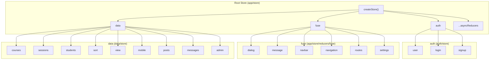

# Redux Store Documentation

> **Directories:** `src/app/store/`, `src/app/auth/store/`, `src/app/data/store/`
> **Files:** 43 · **Middleware:** `redux-thunk`
> **Purpose:** Centralized state management for authentication, UI framework, and all domain data (courses, sessions, students, admin analytics, messaging, mobile check-in).

---

## Architecture Overview



### Store Configuration — `app/store/index.js`

- Uses `redux-thunk` middleware for async actions
- Supports Redux DevTools in development
- **Dynamic reducer injection** via `injectReducer(key, reducer)` + `withReducer` HOC
- Contains Firefox DevTools compatibility fix

### `withReducer` HOC — `app/store/withReducer.js`

Higher-order component that injects a reducer on mount. Uses `ReactReduxContext.Consumer` to conditionally render the wrapped component only after the reducer is available in the store.

```js
// Usage pattern:
export default withReducer("someKey", someReducer)(MyComponent);
```

---

## 1. Auth Store — `auth/store/`

### 1.1 Action Types

| Type                                                 | Source | Description                                         |
| ---------------------------------------------------- | ------ | --------------------------------------------------- |
| `SET_USER_DATA`                                      | user   | Store user profile data                             |
| `SET_USER_DATA_FAILED`                               | user   | User update failed                                  |
| `REMOVE_USER_DATA`                                   | user   | Clear user data (no-op currently)                   |
| `USER_LOGGED_OUT`                                    | user   | Logout — resets auth + data stores                  |
| `GET_UNIVERSITIES_DATA_SUCCESS`                      | user   | Static universities data loaded                     |
| `OPEN_REFERRAL_DIALOG`                               | user   | Toggle referral dialog                              |
| `OPEN_PREMIUM_DIALOG`                                | user   | Toggle premium upsell dialog                        |
| `OPEN_PRICING_DIALOG`                                | user   | Toggle pricing dialog (with title/text/hideButtons) |
| `OPEN_ATTENDEES_IMPORT_DIALOG`                       | user   | Toggle attendees import dialog                      |
| `OPEN_IMPORT_EXCEL_FOR_GRADING_DIALOG`               | user   | Toggle grading import dialog                        |
| `LOGIN_SUCCESS` / `LOGIN_ERROR`                      | auth   | Host or attendee login result                       |
| `SIGNUP_SUCCESS` / `SIGNUP_ERROR`                    | auth   | Host signup result                                  |
| `CONFIRM_SUCCESS` / `CONFIRM_ERROR`                  | auth   | Email/phone verification result                     |
| `ATTENDEE_SIGNUP_SUCCESS` / `ATTENDEE_SIGNUP_FAILED` | auth   | Attendee registration result                        |
| `CONFIRM_CODE_RESENT` / `CONFIRM_CODE_RESENT_ERROR`  | auth   | Verification code resend result                     |
| `TRY_LOGIN` / `TRY_LOGIN_ERROR`                      | auth   | Attendee code validation result                     |
| `CHECK_ATTENDEE_EMAIL_EXIST_SUCCESS` / `_ERROR`      | auth   | Email uniqueness check                              |
| `CONNECTION_DATA_FETCH_SUCCESS` / `_ERROR`           | auth   | Geo-IP connection data                              |
| `LOGIN_SHOW_VERIFICATION`                            | auth   | Pre-populate verification form                      |
| `FORGOT_SHOW_VERIFICATION`                           | auth   | Pre-populate password reset form                    |

### 1.2 Auth Action Creators — `auth/store/actions/auth.actions.js` (283 lines)

| Action Creator                                          | Description                                               |
| ------------------------------------------------------- | --------------------------------------------------------- |
| `submitSignup({ name, password, email, referralCode })` | Host signup via Cognito → `SIGNUP_SUCCESS`                |
| `signUpAttendee(props)`                                 | Attendee signup via API → `ATTENDEE_SIGNUP_SUCCESS`       |
| `submitLogin({ email, password })`                      | Host login via Cognito → sets user data → `LOGIN_SUCCESS` |
| `submitAttendeeLogin(phone, code)`                      | Attendee login via API → `LOGIN_SUCCESS`                  |
| `submitConfirmation({ email, confirmation })`           | Email verification → `CONFIRM_SUCCESS`                    |
| `confirmAttendee({ id, confirmation })`                 | Phone verification → `CONFIRM_SUCCESS`                    |
| `forgotPassword({ email })`                             | Initiate password reset                                   |
| `forgotPasswordSubmit({ email, code, password })`       | Complete password reset                                   |
| `resendConfirmationCode(email)`                         | Resend host verification code via Cognito                 |
| `resendAttendeeCode(data)`                              | Resend attendee SMS code                                  |
| `resendAttendeeVoiceCode(data)`                         | Resend attendee voice code                                |
| `trySendAttendeeCode(data)`                             | Validate attendee before sending code                     |
| `checkAttendeeEmailExist(data)`                         | Check if attendee email is registered                     |
| `getConnectionData()`                                   | Fetch geo-IP data via ipapi.co                            |
| `populateVerification(email, code)`                     | Pre-fill verification form fields                         |
| `populatePasswordVerification(email, code)`             | Pre-fill password reset form fields                       |

### 1.3 User Action Creators — `auth/store/actions/user.actions.js` (404 lines)

| Action Creator                                                             | Description                                                                                              |
| -------------------------------------------------------------------------- | -------------------------------------------------------------------------------------------------------- |
| `setUserDataAwsCognito(idToken)`                                           | Main login handler: decodes JWT, fetches host from API, syncs cookie consent, dispatches `SET_USER_DATA` |
| `setUserDataAttendee(data)`                                                | Creates attendee user object with `role: "attendee"`                                                     |
| `setUserData(user)`                                                        | Core dispatcher for `SET_USER_DATA`                                                                      |
| `updateUserSettings(settings)`                                             | Merges settings into user data                                                                           |
| `updateUserShortcuts(shortcuts)`                                           | Updates user shortcuts                                                                                   |
| `removeUserData()`                                                         | Dispatches `REMOVE_USER_DATA`                                                                            |
| `logoutUser(redirectUrl)`                                                  | Sends analytics → signs out via Cognito → resets settings → dispatches `USER_LOGGED_OUT`                 |
| `updateUserData(data)`                                                     | Persists host data to API, dispatches updated user                                                       |
| `removeHostInviteToGroup(user, invitationData)`                            | Accept group invitation then remove invite                                                               |
| `removeMembersFromAdminGroup(members, user)`                               | Remove members from admin group                                                                          |
| `setImpersonateId(impersonateId)`                                          | Sets impersonation in localStorage, reloads host data, redirects to `/`                                  |
| `removeImpersonateId(data)`                                                | Clears impersonation                                                                                     |
| `getHostData()`                                                            | Refreshes host data from API                                                                             |
| `getUniversitiesData()`                                                    | Loads static university data                                                                             |
| `openReferralDialog()` / `closeReferralDialog()`                           | Toggle referral dialog state                                                                             |
| `openPricingDialog(title, text, hideButtons)` / `closePricingDialog()`     | Toggle pricing dialog with params                                                                        |
| `openPremiumDialog()` / `closePremiumDialog()`                             | Toggle premium dialog state                                                                              |
| `openAttendeesImportDialog()` / `closeAttendeesImportDialog()`             | Toggle import dialog                                                                                     |
| `openImportExcelForGradingDialog()` / `closeImportExcelForGradingDialog()` | Toggle grading dialog                                                                                    |

### 1.4 Auth Reducers

**`user` reducer** — State shape:

```js
{
  role: "unknown" | "host" | "attendee" | "guest",
  data: { displayName, photoURL, email, id, shortcuts, settings, theme },
  universitiesData: undefined | [...],
  fetched: false,
  // Dialog flags:
  referralDialogOpen, pricingDialogOpen, premiumDialogOpen,
  importAttendeesDialogOpen, importExcelForGradingDialogOpen,
  pricingDialogTitle, pricingDialogText, pricingDialogHideButtons
}
```

**`login` reducer** — State shape:

```js
{ success: false, code: '', connection: null, error: { username, password } }
```

**`signup` reducer** — State shape:

```js
{ success: false, error: { username, password } }
```

> **Cross-store coupling:** `USER_LOGGED_OUT` resets both `courses` and `sessions` reducers in `data/store` back to `initialState`.

---

## 2. Data Store — `data/store/`

### 2.1 Course Action Types (41 constants)

| Type                            | Category   | Description                                        |
| ------------------------------- | ---------- | -------------------------------------------------- |
| `GOT_COURSES`                   | Courses    | All courses loaded                                 |
| `SELECT_COURSE`                 | Courses    | Course selected, sessions loaded                   |
| `COURSE_LOADING`                | Loading    | Toggle loading state                               |
| `SET_ERROR`                     | Error      | Set error message                                  |
| `LATEST_COURSE_SELECTED`        | Courses    | Flag for newly created course                      |
| `GOT_RUN_SESSION_BUTTON_REF`    | UI Refs    | Store button element ref                           |
| `GOT_DOWNLOAD_EXCEL_BUTTON_REF` | UI Refs    | Store button element ref                           |
| `COURSE_DASHBOARD`              | Views      | Dashboard view with sessions + students + checkins |
| `COURSE_SESSIONS`               | Views      | Sessions list view                                 |
| `COURSE_STUDENTS`               | Views      | Students list view                                 |
| `COURSE_FIELD_STUDENTS`         | Views      | Field course students view                         |
| `COURSE_MESSAGES`               | Views      | Messages view                                      |
| `SESSION_STUDENTS`              | Views      | Single session's students                          |
| `STUDENT_SESSIONS`              | Views      | Single student's sessions                          |
| `STUDENT_FIELD_CHECKINS`        | Views      | Field check-ins for student                        |
| `AUTO_SESSIONS`                 | Sessions   | Auto-mode sessions loaded                          |
| `CREATED_SESSION`               | Sessions   | Session created → navigate                         |
| `CREATED_FUTURE_SESSION`        | Sessions   | Future session scheduled                           |
| `UPDATED_SESSION`               | Sessions   | Session renamed                                    |
| `DELETED_SESSION`               | Sessions   | Session deleted                                    |
| `MERGE_SESSIONS`                | Sessions   | Sessions merged                                    |
| `END_SESSION`                   | Sessions   | Session ended                                      |
| `UPDATE_SESSION_DATA`           | Sessions   | Session data updated                               |
| `CREATE_STUDENT_MANUAL`         | Students   | Manual attendee added                              |
| `DELETE_STUDENTS`               | Students   | Attendees removed                                  |
| `UPDATE_STUDENT`                | Students   | Attendee updated                                   |
| `GOT_PENDING_CHECKIN_REQUESTS`  | Check-in   | Late check-in requests loaded                      |
| `REFRESH_VIEW`                  | Views      | Refresh students + sessions + requests             |
| `RESET_DATA`                    | Data       | Reset course data on creation                      |
| `SENT_COURSE_MESSAGE`           | Messages   | Message sent, list refreshed                       |
| `DELETE_COURSE_MESSAGE`         | Messages   | Message deleted                                    |
| `GET_COURSE_MESSAGES`           | Messages   | Messages loaded                                    |
| `DELETE_FIELD_CHECKIN`          | Field      | Field check-in deleted                             |
| `NEXT_STUDENT` / `PREV_STUDENT` | Navigation | Student prev/next                                  |
| `NEXT_SESSION` / `PREV_SESSION` | Navigation | Session prev/next                                  |
| `ADMIN_VIEW`                    | Admin      | Set admin view                                     |

### 2.2 Course Action Creators — `courses.actions.js` (829 lines)

| Action Creator                                                       | API Calls                                                                               | Side Effects                                           |
| -------------------------------------------------------------------- | --------------------------------------------------------------------------------------- | ------------------------------------------------------ |
| `getCourses()`                                                       | `getAllCourses`                                                                         | Dispatches `GOT_COURSES`                               |
| `createCourse(props)`                                                | `addCourse`, `getAllCourses`                                                            | Auto-selects new course, loads sessions/field students |
| `updateCourse(props)`                                                | `updateCourse`, `getAllCourses`                                                         | Refreshes course list                                  |
| `deleteCourse(courseId)`                                             | `deleteCourse`, `getAllCourses`, `getCourseSessions`                                    | Selects first remaining course                         |
| `selectCourse(courseId)`                                             | `getCourseSessions`                                                                     | Sets `SELECT_COURSE`                                   |
| `viewCourse(courseId, viewType, loadData, fieldCheckin, studentId)`  | Delegates to `getCourseData` or `changeView`                                            | Smart loader                                           |
| `getCourseData(courseId, viewType, fieldCheckin, studentId)`         | `getCourseFieldCheckins`, `getCourseSessions`, `getCourseStudents`                      | Loads full dashboard data                              |
| `getCourseStudents(courseId)`                                        | `getCourseStudents`                                                                     | Dispatches `COURSE_STUDENTS`                           |
| `createSession(props)`                                               | `createSession`                                                                         | Stores in localStorage, dispatches `CREATED_SESSION`   |
| `createFutureSession(props)`                                         | `createFutureSession`                                                                   | Dispatches `CREATED_FUTURE_SESSION`                    |
| `resumeSession(props, sessionId)`                                    | `resumeSession`                                                                         | Like `createSession` but for paused sessions           |
| `renameSession(courseId, sessionId, name)`                           | `renameSession`                                                                         | Refreshes courses + sessions                           |
| `deleteSession(courseId, sessionId)`                                 | `deleteSession`                                                                         | Dispatches `DELETED_SESSION`                           |
| `mergeSessions(toId, fromIds, courseId, method)`                     | `mergeSessions`                                                                         | Refreshes sessions                                     |
| `endSession(courseId, sessionId, attendees, host, counter)`          | `updateHostSessionsCounter`, `endSession`, `endSessionVerifyAttendees`                  | Clears localStorage, refreshes data                    |
| `getCourseSessions(courseId)`                                        | `getCourseSessions`                                                                     | Adds `serialId` to each session                        |
| `getAutoSessions(room)`                                              | `getAutoSessions`                                                                       | Dispatches `AUTO_SESSIONS`                             |
| `sendMessage(courseId, title, message, hostId)`                      | `sendMessage`, `getCourseMessages`                                                      | Refreshes messages                                     |
| `deleteMessage(courseId, messageId, hostId)`                         | `deleteMessage`, `getCourseMessages`                                                    | Refreshes messages                                     |
| `getCourseMessages(courseId, hostId)`                                | `getCourseMessages`                                                                     | Dispatches `GET_COURSE_MESSAGES`                       |
| `createStudentManual(courseId, formState)`                           | `createAttendeeUser`                                                                    | Dispatches `CREATE_STUDENT_MANUAL`                     |
| `deleteStudents(courseId, students)`                                 | `deleteAttendeeUser` × N (parallel)                                                     | Dispatches `DELETE_STUDENTS`                           |
| `updateAttendee(formData)`                                           | `updateAttendee`                                                                        | Dispatches `UPDATE_STUDENT`                            |
| `checkUncheck(courseId, sessionId, student, checkin, view, session)` | `handleLateRequestCheckin` or `checkUncheck`, then refreshes students+sessions+requests | Complex check-in toggle                                |
| `updateCheckins(view, courseId)`                                     | `getCourseStudents`, `getCourseSessions`, `getCheckinPendingRequests`                   | Full refresh of current view                           |
| `deleteFieldCheckin({ checkinId, courseId })`                        | `deleteFieldCheckin`, `getCourseFieldCheckins`                                          | Refreshes field check-ins                              |
| `getPendingCheckinRequests()`                                        | `getCheckinPendingRequests`                                                             | Dispatches `GOT_PENDING_CHECKIN_REQUESTS`              |
| `exportExcelReport(course, host)`                                    | `exportExcelReport`                                                                     | Generates multi-sheet workbook via `ExcelReportHelper` |
| `sendReminderEmail(email)`                                           | `sendReminderEmail`                                                                     | Fire-and-forget                                        |
| `selectSession(courseId, sessionId)`                                 | —                                                                                       | Pure view change                                       |
| `selectSessionStudents(courseId, sessionId)`                         | `getCourseStudents`                                                                     | Load students for session view                         |
| `selectSessionStudent(courseId, studentId)`                          | `getCourseSessions`                                                                     | Load sessions for student view                         |
| `selectFieldCourseStudent(courseId, studentId)`                      | —                                                                                       | Pure view change                                       |
| `selectStudentCourse(courseId, studentId)`                           | `getCourseStudents`, `getCourseSessions`                                                | Load both for student-course view                      |
| `handleStudentNavigation(studentId, direction)`                      | —                                                                                       | Prev/next student                                      |
| `handleSessionNavigation(sessionId, direction)`                      | —                                                                                       | Prev/next session                                      |
| `updateSessionData(data, sessionId)`                                 | `updateSessionData`                                                                     | Generic session update                                 |

### 2.3 Admin Action Creators — `admin.actions.js` (273 lines)

| Action Creator                                   | Description                                 |
| ------------------------------------------------ | ------------------------------------------- |
| `getAdminGeneralStatistics(data)`                | Fetches general admin stats with date range |
| `getAdminCoursesGeneralStatistics(data)`         | Course-level stats table data               |
| `getAdminCoursesGraphStatistics(data)`           | Course graph time series data               |
| `getAdminCoursesFullStatistics(data)`            | Full course statistics (same as graph)      |
| `getAdminHostsGeneralStatistics(data)`           | Host-level stats table data                 |
| `getAdminHostsGraphStatistics(data)`             | Host graph time series data                 |
| `getInstituteAttendeesStatistics(data)`          | Institute attendees stats for reports       |
| `getAttendeesInfo(data)`                         | Bulk fetch attendee info                    |
| `resetInstituteAttendeesStatistics(data)`        | Clear stats from state                      |
| `viewAdminGeneralStats(viewType, loadData, ...)` | Smart loader: fetch or view change          |
| `setDates(dates)`                                | Set admin date range filter                 |
| `setAdminMainElementsView(elementsView)`         | Toggle graph/stats/table visibility         |
| `changeAdminViewType(adminViewType)`             | Change date grouping (day/week/month)       |
| `changeAdminView(view)`                          | Pure view change                            |

### 2.4 Sort Actions — `sort.actions.js` (64 lines)

Table sorting, pagination, and selection (exported via `dispatchActions` object):

| Action                                  | Description                 |
| --------------------------------------- | --------------------------- |
| `initSort(viewType)`                    | Reset sort state for a view |
| `createSortHandler(property)`           | Toggle sort order on column |
| `handleChangePage(event, page)`         | Change table page           |
| `handleChangeRowsPerPage(event)`        | Change rows per page        |
| `handleSelectAllClick(event, allItems)` | Select/deselect all items   |
| `handleClearSelection()`                | Clear selection             |
| `handleItemChecked(event, itemId)`      | Toggle single item          |
| `handleItemsChecked(items)`             | Toggle multiple items       |

### 2.5 Mobile Actions — `mobile.actions.js` (96 lines)

Attendee-side check-in flow:

| Action Creator                                               | Description                                            |
| ------------------------------------------------------------ | ------------------------------------------------------ |
| `sessionData(shortId)`                                       | Fetch session by short ID (direct fetch, no Amplify)   |
| `validateSession(shortId, code, icon)`                       | Validate session QR code (uses mock data — incomplete) |
| `checkinSession(courseid, sessionid, student, method, icon)` | Perform attendee check-in                              |
| `resetSession()`                                             | Clear mobile session state                             |

> **⚠️ Note:** `validateSession` uses hardcoded mock data — likely incomplete/development code.

### 2.6 Posts Actions — `posts.actions.js` (16 lines)

| Action Creator | Description                                |
| -------------- | ------------------------------------------ |
| `getPosts()`   | Fetch posts via `ezDataService.getPosts()` |

---

## 3. Data Store Reducers

### 3.1 `courses` Reducer — State Shape

```js
{
  courseId: null,
  view: "COURSE_DASHBOARD",
  action: "IDLE",
  courses: null,
  messages: [],
  loading: true,
  runSessionButtonRef: null,
  exportExcelReportRef: null,
  latestCourseSelected: false,
  error: null,
  checkins: [],        // field check-ins (deepcopy)
  autoSessions: [],    // auto-mode sessions
  studentId: null
}
```

Handles: `GOT_COURSES`, `COURSE_LOADING`, `COURSE_SESSIONS`, `COURSE_DASHBOARD`, `COURSE_STUDENTS`, `STUDENT_SESSIONS`, `STUDENT_FIELD_CHECKINS`, `AUTO_SESSIONS`, `SET_ERROR`, `DELETE_FIELD_CHECKIN`, `LATEST_COURSE_SELECTED`, button refs, and `USER_LOGGED_OUT` (full reset).

### 3.2 `sessions` Reducer — State Shape

```js
{
  courseId: 0, sessionId: 0,
  view: "COURSE_DASHBOARD",
  sessions: [],           // deepcopy of sessions array
  session: null,
  nextSession: false, prevSession: false
}
```

Key behavior:

- `COURSE_DASHBOARD` / `REFRESH_VIEW` / `STUDENT_SESSIONS` — deep-copies sessions from payload
- `SESSION_STUDENTS` — computes `nextSession` / `prevSession` with `updatePrevNext()`
- `NEXT_SESSION` / `PREV_SESSION` — navigate between sessions with index math
- `END_SESSION` — clears current session, resets to sessions view

### 3.3 `students` Reducer — State Shape

```js
{
  students: [],           // deepcopy of students array
  courseId: "", studentId: "",
  nextStudent: false, prevStudent: false,
  checkinRequests: []
}
```

Key behavior:

- Multiple action types deep-copy `students` from payload
- `STUDENT_SESSIONS` — computes `nextStudent` / `prevStudent`
- `NEXT_STUDENT` / `PREV_STUDENT` — navigate between students
- `REFRESH_VIEW` — updates both `students` and `checkinRequests`

### 3.4 `sort` Reducer — State Shape

```js
{
  items: [], order: "asc", orderBy: null,
  page: 0, rowsPerPage: 25, selected: [],
  viewType: "COURSE_DASHBOARD"
}
```

Reusable table sort/pagination/selection state used across all data table views.

### 3.5 `view` Reducer — Global View Tracker

```js
{ type: <last action type>, view: <last viewType> }
```

Updates on **every** action that includes `type` or `viewType`. Acts as a global "current view" tracker.

### 3.6 `messages` Reducer

```js
{ action: "IDLE", messages: [], loading: true }
```

Handles: `SENT_COURSE_MESSAGE`, `DELETE_COURSE_MESSAGE`, `GET_COURSE_MESSAGES`.

### 3.7 `mobile` Reducer

```js
{ wait: false, sessionIsValid: false, session: {}, error: '' }
```

Handles: `SESSION_IS_VALID`, `SESSION_DATA`, `SESSION_ERROR`, `RESET_SESSION`, `SESSION_REQUEST`.

### 3.8 `admin` Reducer — State Shape

```js
{
  view: "ADMIN_MAIN_DASHBOARD",
  action: "IDLE",
  adminStats: [],
  adminCoursesStats: { coursesData: null },
  adminCoursesGraphStats: null,
  adminHostsStats: null,
  adminHostsGraphStats: null,
  instituteAttendeesStats: null,
  attendeesInfo: null,
  adminViewType: { dataType: "PERCENT", datesType: "WEEK" },
  adminMainElementsView: { adminMainGraphShow: true, adminMainStatsShow: true, adminMainTableShow: true },
  loading: true,
  graphLoading: false,
  dates: null
}
```

### 3.9 `posts` Reducer

```js
{ action: "IDLE", posts: [[], [], [], [], [], []] }
```

---

## 4. ExcelReportHelper — `excelReportHelper.js` (561 lines)

Client-side Excel workbook generator using ExcelJS. Used by `exportExcelReport` action.

| Method                                                 | Description                                                                  |
| ------------------------------------------------------ | ---------------------------------------------------------------------------- |
| `exportAndDownloadExcelWorkbook(data, ...)`            | Orchestrates full report: summary → sessions → students → per-session sheets |
| `buildSummarySheet(workbook, data)`                    | Course name, host, email, session count, student count, attendance rate      |
| `buildSessionsSheet(workbook, data)`                   | All sessions with date, time, check-ins, attendance rate                     |
| `buildStudentsSheet(workbook, data, ...)`              | Student × session attendance matrix with Present/Absent color coding         |
| `buildSessionSheet(workbook, attendees, session, ...)` | Per-session detail: check-in time, method, location status with color coding |
| `sanitizeWorksheetName(name)`                          | Removes invalid Excel characters, limits to 31 chars                         |

---

## 5. Data Sources (Unused/Legacy)

| File                     | Status     | Description                                              |
| ------------------------ | ---------- | -------------------------------------------------------- |
| `sources/Courses.js`     | **Empty**  | Stub with `PAGINATION_LIMIT = 10` and empty `getCourses` |
| `sources/Courses.gql.js` | **Unused** | GraphQL `listContainers` query — legacy AppSync query    |

---

## 6. Fuse Framework Store — `app/store/actions/fuse/` & `app/store/reducers/fuse/`

Framework-provided store slices for UI management:

| Slice        | Purpose                                              |
| ------------ | ---------------------------------------------------- |
| `dialog`     | Global dialog open/close state                       |
| `message`    | Snackbar/toast message state                         |
| `navbar`     | Navbar open/close/fold state                         |
| `navigation` | Navigation menu items configuration                  |
| `routes`     | Route definitions                                    |
| `settings`   | Theme settings, layout config, RTL, custom scrollbar |

---

## 7. Data Flow Patterns

### Pattern 1: Load → Dispatch → Deep-Copy

Most data fetching follows this pattern:

```
Action Creator → async API call → dispatch({ type, payload }) → Reducer deep-copies payload
```

> **Performance concern:** `deepcopy` is used extensively in `sessions` and `students` reducers. In the rebuild, use immutable state updates or `immer` instead.

### Pattern 2: Cascading Fetches

After mutations, actions typically re-fetch the full list:

```
createCourse → getAllCourses → getCourseSessions  (3 serial API calls)
endSession → updateHostSessionsCounter → endSession → endSessionVerifyAttendees → getCourses → getCourseData  (5+ calls)
```

### Pattern 3: View State Machine

The `view` field acts as a state machine across reducers:

```
COURSE_DASHBOARD → COURSE_SESSIONS → SESSION_STUDENTS → STUDENT_SESSIONS
                 → COURSE_STUDENTS → STUDENT_SESSIONS
                 → COURSE_FIELD_STUDENTS → STUDENT_FIELD_CHECKINS
```

---

## 8. Rebuild Notes

> [!IMPORTANT]
> **Must preserve in rebuild:**
>
> - All action types and their exact payload shapes (components depend on these)
> - The view state machine logic for course → session → student navigation
> - `USER_LOGGED_OUT` cross-store reset behavior
> - `serialId` assignment pattern on sessions (reverse index for display numbering)
>
> **Note on Super Admin state:** The super admin views (`superAdmin/HostsActivity.js` 273 lines, `superAdmin/AttendeesByDomain.js`, `GroupAdmin/GroupAdminHostsActivity.js` 277 lines) do **not** use Redux state — they fetch data directly via `EZDataService` methods (e.g., `getHostsActivity()`, `getAttendeesByDomain()`) and manage local component state. These do not need Redux migration but should use TanStack Query in the rebuild.

> [!TIP]
> **Recommended improvements:**
>
> 1. Replace Redux + thunks with React 19 `useActionState` or TanStack Query for data fetching
> 2. Replace `deepcopy` with immer or structural sharing
> 3. Eliminate cascading re-fetches — use optimistic updates
> 4. Move dialog open/close state into components (not Redux)
> 5. Move ExcelReportHelper into a dedicated service/worker
> 6. Remove unused data sources (`Courses.js`, `Courses.gql.js`)
> 7. Add TypeScript for action types and state shapes
> 8. `validateSession` in mobile actions uses mock data — implement properly
