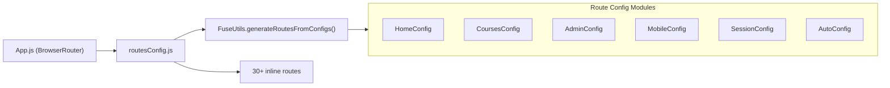

# Routing Configuration Documentation

> **File:** `src/app/fuse-configs/routesConfig.js` · **167 lines**
> **Purpose:** Central route registry combining all module route configs + inline routes.

---

## Architecture

---

## Route Config Modules

| Config          | Module                          | Route(s)                                                                            |
| --------------- | ------------------------------- | ----------------------------------------------------------------------------------- |
| `HomeConfig`    | `main/home/HomeConfig.js`       | `/home`, `/verify/:email/:code`, `/login`, `/signup`, `/forgot`, `/verify-password` |
| `CoursesConfig` | `main/courses/CoursesConfig.js` | `/courses`                                                                          |
| `AdminConfig`   | `main/admin/AdminConfig.js`     | `/admin`                                                                            |
| `SessionConfig` | `main/Session/SessionConfig.js` | `/session/:shortid`                                                                 |
| `AutoConfig`    | `main/auto/AutoConfig.js`       | Auto-mode routes                                                                    |
| `MobileConfig`  | `main/mobile/MobileConfig.js`   | 25+ attendee routes (see below)                                                     |

---

## All Routes (Complete Map)

### Host-Side (Authenticated)

| Route               | Component        | Auth Required | Description                 |
| ------------------- | ---------------- | :-----------: | --------------------------- |
| `/`                 | Home             |       —       | Landing page                |
| `/home`             | Home             |       —       | Landing page (explicit)     |
| `/courses`          | Courses          |       ✓       | Course management dashboard |
| `/admin`            | Admin            |       ✓       | Institute admin dashboard   |
| `/session/:shortid` | Session          |       ✓       | Live check-in session       |
| `/m_session`        | MinimizedSession |       ✓       | Minimized session popup     |
| `/auto`             | AutoMode         |       ✓       | Auto-session mode           |

### Auth & Verification

| Route                           | Component          | Description                 |
| ------------------------------- | ------------------ | --------------------------- |
| `/login`                        | Home (with dialog) | Login dialog                |
| `/signup`                       | Home (with dialog) | Signup dialog               |
| `/forgot`                       | Home (with dialog) | Forgot password             |
| `/verify/:email/:code`          | Home               | Email verification          |
| `/verify-password/:email/:code` | Home               | Password reset verification |
| `/referral/:code`               | Home               | Referral signup             |

### Attendee-Side (Mobile)

| Route                           | Component    | Description                |
| ------------------------------- | ------------ | -------------------------- |
| `/checkin/:shortid/:code/:icon` | Mobile Home  | QR check-in (from QR scan) |
| `/checkin`                      | Mobile Home  | Manual check-in entry      |
| `/quiz/:shortid`                | Quiz         | Icon quiz verification     |
| `/sessionlogin`                 | SignUp       | Attendee registration      |
| `/getsessionid`                 | GetSessionId | Enter session ID manually  |
| `/download`                     | Download     | App download page          |

### Web-Variant Routes (`/w/` prefix)

Routes prefixed with `/w/` bypass the mobile redirect HOC to force web versions:

`/w/sessionlogin`, `/w/getsessionid`, `/w/quiz/:shortid`, `/w/checkin/:shortid/:code/:icon`, `/w/checkin`, `/w/download`, `/w/help`

### Public Pages

| Route               | Component                | Description             |
| ------------------- | ------------------------ | ----------------------- |
| `/pricing`          | Pricing (mobile/desktop) | Pricing plans           |
| `/terms`            | Tos                      | Terms of service        |
| `/privacy`          | Privacy                  | Privacy policy          |
| `/accessibility`    | Accessability            | Accessibility statement |
| `/attendee/terms`   | TosAttendee              | Attendee terms          |
| `/attendee/privacy` | PrivacyAttendee          | Attendee privacy        |
| `/about`            | Home                     | About page              |
| `/WhatVersion`      | Version                  | Version info            |

### Blog

| Route       | Component | Description  |
| ----------- | --------- | ------------ |
| `/blog`     | Posts     | Blog listing |
| `/blog/:id` | Post      | Blog article |

### Super Admin

| Route                  | Component         | Description            |
| ---------------------- | ----------------- | ---------------------- |
| `/hosts_by_activity`   | HostsActivity     | Host activity report   |
| `/attendees_by_domain` | AttendeesByDomain | Attendee domain report |

---

## Code Splitting

All route components use `@loadable/component` for code splitting with `webpackPrefetch: true` hints.

---

## Rebuild Notes

> [!WARNING]
>
> 1. Many routes are duplicated between `routesConfig.js` inline routes and `MobileConfig.js`
> 2. The `mobileRedirect` HOC creates route fragmentation — replace with responsive design
> 3. Auth guards are applied per-component (e.g. `Session` guard in `Courses.js`), not at the route level
> 4. `/w/` prefix pattern is a workaround — should be eliminated
