# Services Layer Documentation

> **Directory:** `src/app/services/`
> **Files:** 33 · **Total Lines:** ~4,200+
> **Purpose:** Application-wide business logic, API communication, data persistence, real-time messaging, authentication, analytics, and Excel reporting.

---

## Architecture Overview

```mermaid
graph TD
    subgraph "Core Data Layer"
        EZD[EZDataService<br/>Singleton · 1853 lines]
        COGNITO[AwsCognitoService<br/>Singleton · 242 lines]
        WS[EZWSPubSub<br/>WebSocket · 208 lines]
        APPSYNC[SessionSubscriber<br/>GraphQL · 54 lines]
    end

    subgraph "Domain Services"
        COURSE[courseService]
        SESSION[sessionService]
        ADMIN[adminService]
        FIELD[fieldCourseService]
        GEO[geoService]
        AUTO[autoModeService]
        MSG[messagesService]
        ATT[attendeesService]
    end

    subgraph "Utility Services"
        DATE[dateServices]
        SCREEN[screenService]
        EXCEL[excelService]
        TAWK[tawktoServices]
        VALID[validationService]
        FORMAT[formatNumbers]
        COOKIE[cookiesPopup]
        FILTER[filtersService]
        STUID[getStudentIdService]
        STUDTEST[studentIdTest]
    end

    subgraph "Reporting Services"
        FRPT[fieldCourseExcelService]
        INST[institutionalReportsService]
        CRPT[classReportService]
        FLDRT[fieldReportService]
    end

    subgraph "Integration Services"
        GA[googleanalyticsservice]
        HOME[home/services]
        CONTACT[contactService/services]
    end

    EZD -->|AWS Amplify API| BACKEND[API Gateway]
    COGNITO -->|AWS Amplify Auth| COGPOOL[Cognito User Pool]
    WS -->|Sockette| WSAPI[WebSocket API]
    APPSYNC -->|Amplify GraphQL| GRAPHQL[AppSync]

    COURSE --> EZD
    SESSION --> COURSE
    SESSION --> MSG
    SESSION --> GA
    AUTO --> SESSION
    GEO --> EZD
    FRPT --> EXCEL
    FRPT --> FIELD
    FRPT --> GEO
    GA --> EZD
    INST --> CRPT
    INST --> FLDRT
    INST --> EXCEL
```



---

## 1. Core Data Layer

### 1.1 EZDataService — `ezdataservice/ezdataservice.js`

| Property         | Value                                                                  |
| ---------------- | ---------------------------------------------------------------------- |
| **Pattern**      | Singleton (exported `instance`)                                        |
| **Lines**        | 1,853                                                                  |
| **Dependencies** | `@aws-amplify/api`, `mobile-detect`, `ipapi.co`, `pako`, `cryptojs.js` |
| **Encryption**   | AES via CryptoJS with key `ezinfo007`                                  |

#### API Path Map

| Constant       | Path             | Domain                              |
| -------------- | ---------------- | ----------------------------------- |
| `Courses`      | `/courses`       | Course CRUD                         |
| `Sessions`     | `/sessions`      | Session lifecycle                   |
| `Attendees`    | `/attendees`     | Attendee registration/verification  |
| `Host`         | `/new_hosts`     | Host profile, group invites, lookup |
| `Admin`        | `/new_hosts`     | Analytics, messaging, configuration |
| `Groups`       | `/groups`        | Group/faculty management            |
| `Config`       | `/new_config`    | App configuration                   |
| `FieldCheckin` | `/field_checkin` | Shift-based check-in                |
| `Office`       | `/office`        | Contact forms                       |

#### Methods by Domain

**Courses (8 methods)**

| Method                                          | HTTP | Endpoint                                | Description                                       |
| ----------------------------------------------- | ---- | --------------------------------------- | ------------------------------------------------- |
| `getAllCourses()`                               | GET  | `/courses/{hostid}`                     | Fetches all courses for current host              |
| `addCourse(props)`                              | POST | `/courses`                              | Creates a new course                              |
| `updateCourse(props)`                           | PUT  | `/courses/{id}`                         | Updates course properties                         |
| `deleteCourse(courseId)`                        | DEL  | `/courses/{courseId}/{hostid}`          | Deletes a course                                  |
| `getCourseStudents(courseId)`                   | GET  | `/courses/{courseId}/students`          | Lists enrolled students                           |
| `getCourseFieldCheckins(courseId)`              | GET  | `/courses/field_checkins/{courseId}`    | Gets field checkins (supports pako decompression) |
| `getIsCourseLockedForDynamicAddingAttendees(…)` | GET  | `/courses/{courseId}/attendee/{userId}` | Check if course is locked                         |
| `getLatestCourse(id)`                           | GET  | `/new_hosts/latest_course`              | Gets most recently used course                    |

**Course Templates (4 methods)**

| Method                             | HTTP | Endpoint                                       |
| ---------------------------------- | ---- | ---------------------------------------------- |
| `getCourseTemplates(groupId)`      | GET  | `/courses/get_course_templates/{groupId}`      |
| `createNewCourseTemplate(data)`    | POST | `/courses/create_course_template`              |
| `updateCourseTemplate(data)`       | POST | `/courses/update_course_template`              |
| `deleteCourseTemplate(templateId)` | DEL  | `/courses/delete_course_template/{templateId}` |

**Sessions (12 methods)**

| Method                                      | HTTP | Endpoint                                       | Description                             |
| ------------------------------------------- | ---- | ---------------------------------------------- | --------------------------------------- |
| `createSession(props)`                      | POST | `/sessions`                                    | Start a live session                    |
| `createFutureSession(props)`                | POST | `/sessions/future`                             | Schedule future session                 |
| `resumeSession(props, sessionId)`           | PUT  | `/sessions/{courseId}/{sessionId}`             | Resume paused session                   |
| `renameSession(…)`                          | PUT  | `/sessions/{courseId}/{sessionId}`             | Rename with `action: "update"`          |
| `updateSessionCodes(props)`                 | PUT  | `/sessions/{courseId}/{sessionId}`             | Push new QR code with `action: "codes"` |
| `endSession(courseId, sessionId)`           | PUT  | `/sessions/{courseId}/{sessionId}`             | End session with `action: "end"`        |
| `endSessionVerifyAttendees(…)`              | POST | `/sessions/end_verify/{courseId}/{sessionId}`  | End & verify attendees                  |
| `deleteSession(courseId, sessionId)`        | DEL  | `/sessions/{courseId}/{sessionId}`             | Delete a session                        |
| `getCourseSessions(courseId)`               | GET  | `/sessions/{courseId}`                         | List sessions sorted by date desc       |
| `getAutoSessions(room)`                     | GET  | `/sessions/getautos/{hostid}/{room}`           | List auto-mode sessions                 |
| `getSessionByShortId(shortId)`              | GET  | `/sessions/short/{shortId}`                    | Lookup by short ID                      |
| `getSessionNumberOfCheckins(…)`             | GET  | `/sessions/getcheckins/{courseId}/{sessionId}` | Get live check-in count                 |
| `getSessionStudents(…)`                     | GET  | `/sessions/{courseId}/{sessionId}/students`    | List session attendees                  |
| `handleLateRequestCheckin(data, sessionId)` | PUT  | `/sessions/handle_late_request/{sessionId}`    | Approve/deny late requests              |
| `mergeSessions(…)`                          | POST | `/new_hosts/merge_sessions`                    | Merge multiple sessions                 |
| `updateSessionData(data, sessionId)`        | PUT  | `/sessions/update/{sessionId}`                 | Generic session update                  |

**Attendees (10 methods)**

| Method                           | HTTP | Endpoint                            | Description            |
| -------------------------------- | ---- | ----------------------------------- | ---------------------- |
| `createAttendeeUser(props)`      | POST | `/attendees`                        | Register attendee      |
| `checkAttendeeEmailExist(props)` | POST | `/attendees`                        | Check email uniqueness |
| `deleteAttendeeUser(props)`      | DEL  | `/courses/{courseId}/students/{id}` | Remove attendee        |
| `updateAttendee(body, id)`       | PUT  | `/attendees/{id}`                   | Update attendee data   |
| `confirmAttendee(id, code)`      | POST | `/attendees/verify`                 | Phone verification     |
| `loginAttendee(phone, code)`     | —    | Delegates to `confirmAttendee`      | Attendee login         |
| `resendAttendeeCode(data)`       | POST | `/attendees/code`                   | Resend SMS code        |
| `resendAttendeeVoiceCode(data)`  | POST | `/attendees/voice`                  | Resend voice code      |
| `trySendAttendeeCode(data)`      | POST | `/attendees/trycode`                | Try sending code       |
| `getStudent(studentid)`          | GET  | `/attendees/{studentid}`            | Get single attendee    |

**Check-in (3 methods)**

| Method                             | HTTP | Endpoint                                                          |
| ---------------------------------- | ---- | ----------------------------------------------------------------- |
| `checkUncheck(…)`                  | POST | `/sessions/{courseId}/{sessionId}`                                |
| `isCheckedIn(courseId, sessionId)` | GET  | `/sessions/{courseId}/{sessionId}/verify/{attendeeid}`            |
| `getCheckinPendingRequests()`      | GET  | `/sessions/pending/{hostid}` + `/sessions/field_pending/{hostid}` |

**Host Management (7 methods)**

| Method                                 | HTTP | Endpoint                              |
| -------------------------------------- | ---- | ------------------------------------- |
| `getHost()`                            | GET  | `/new_hosts/{hostid}`                 |
| `updateHost(props)`                    | PUT  | `/new_hosts/{hostid}`                 |
| `findHost(email)`                      | GET  | `/new_hosts/find_host`                |
| `findAttendee(phone, email)`           | GET  | `/new_hosts/find_attendee`            |
| `updateHostSessionsCounter(sessionId)` | PUT  | `/new_hosts/usc/{hostid}/{sessionId}` |
| `updateHostPricingTierSendEmail(…)`    | PUT  | `/new_hosts/change_tier_m/{hostid}`   |
| `sendInvitationToDemo(email)`          | GET  | `/new_hosts/send_invitation_to_demo`  |

**Group/Faculty Management (5 methods)**

| Method                                | HTTP | Endpoint                                          |
| ------------------------------------- | ---- | ------------------------------------------------- |
| `inviteHostToGroup(…)`                | PUT  | `/new_hosts/invite_host_to_group/{hostId}`        |
| `removeHostInviteToGroup(…)`          | PUT  | `/new_hosts/remove_host_invite_to_group/{hostId}` |
| `acceptMemberInvitationToGroup(user)` | POST | `/groups/{groupId}`                               |
| `removeMembersFromAdminGroup(…)`      | POST | `/groups/{groupId}`                               |
| `getStudentCourses(studentid)`        | GET  | `/new_hosts/{hostid}/courses/{studentid}`         |

**Admin Analytics (6 methods)**

| Method                                | HTTP | Endpoint(s)                          | Notes                       |
| ------------------------------------- | ---- | ------------------------------------ | --------------------------- |
| `getAdminGeneralStatistics(…)`        | POST | `ggs_g`, `ggs_gg`, `ggs_f`, `ggs_fg` | 4 parallel requests         |
| `getAdminCoursesGeneralStatistics(…)` | POST | `ggc_g`                              | With date/timezone grouping |
| `getAdminHostsGeneralStatistics(…)`   | POST | `ggh_g`                              | Host-level stats            |
| `getAdminCoursesGraphStatistics(…)`   | POST | `ggc_gg`                             | Graph data for courses      |
| `getAdminHostsGraphStatistics(…)`     | POST | `ggh_gg`                             | Graph data for hosts        |
| `getInstituteAttendeesStatistics(…)`  | POST | `gias` + `gafcs`                     | Combined classroom + field  |

**Admin Lookup (5 methods)**

| Method                           | HTTP | Endpoint                            |
| -------------------------------- | ---- | ----------------------------------- |
| `getAdminUniqueAttendees(…)`     | GET  | `/new_hosts/admin_unique_attendees` |
| `getHostUniqueAttendees(…)`      | GET  | `/new_hosts/host_unique_attendees`  |
| `getHostsByActivity(from, to)`   | GET  | `/new_hosts/host_by_activity`       |
| `getAttendeesByDomain(from, to)` | GET  | `/new_hosts/attendees_by_domain`    |
| `getAttendeesInfo(attendees)`    | POST | `/new_hosts/gai`                    |

**Messaging (4 methods)**

| Method                         | HTTP | Endpoint                         |
| ------------------------------ | ---- | -------------------------------- |
| `sendMessage(…)`               | POST | `/new_hosts/send_message`        |
| `deleteMessage(…)`             | DEL  | `/new_hosts/del_message`         |
| `getCourseMessages(…)`         | GET  | `/new_hosts/get_course_messages` |
| `getMessageDetails(messageId)` | GET  | `/new_hosts/get_message_details` |

**Miscellaneous (8 methods)**

| Method                        | HTTP | Endpoint                                  | Description                   |
| ----------------------------- | ---- | ----------------------------------------- | ----------------------------- |
| `sendInfo(data)`              | POST | `/new_hosts/addi`                         | Send encrypted analytics data |
| `sendContactForm(form)`       | POST | `/office/scf`                             | Encrypted contact form        |
| `getNotifications(data)`      | GET  | `/new_hosts/get_not`                      | Host notifications            |
| `getDiscountCodeInfo(data)`   | GET  | `/new_hosts/get_coupon_info`              | Billing coupon lookup         |
| `exportExcelReport(courseId)` | GET  | `/export/host/{hostid}/course/{courseId}` | Server-side Excel export      |
| `sendReminderEmail(email)`    | POST | `/admin/send_email`                       | Verification reminder         |
| `getBlockedEmailDomains()`    | GET  | `/new_hosts/get_bed`                      | Blocked email domain list     |
| `getConnectionData()`         | —    | ipapi.co                                  | Client geo-IP lookup          |

**Utility Methods**

| Method                                           | Description                                                                            |
| ------------------------------------------------ | -------------------------------------------------------------------------------------- |
| `formatResult(result, options)`                  | Normalizes `_id` → `id` on API responses. Throws if both exist (unless `force: true`). |
| `setImpersonateId(id)` / `removeImpersonateId()` | Manages `custom:impid` in localStorage for admin impersonation                         |
| `getUniversitiesData()`                          | Returns static JSON bundle of university data                                          |
| `getConfigExcelEmailPossibleTitles()`            | Config endpoint for Excel email titles                                                 |

#### Identity Resolution Pattern

The service uses localStorage for identity:

- **`custom:hostid`** — the authenticated host's ID
- **`custom:impid`** — admin impersonation ID (takes precedence when set)
- **`custom:attendeeid`** — the authenticated attendee's ID

Most methods check `impid || hostid` to support admin impersonation transparently.

---

### 1.2 AwsCognitoService — `AWSCognitoService/AwsCognitoService.js`

| Property         | Value                                                |
| ---------------- | ---------------------------------------------------- |
| **Pattern**      | Singleton, extends `FuseUtils.EventEmitter`          |
| **Lines**        | 242                                                  |
| **Dependencies** | `@aws-amplify/auth`, `jwt-decode`, `@fuse/FuseUtils` |

| Method                                        | Description                                                                    |
| --------------------------------------------- | ------------------------------------------------------------------------------ |
| `init()`                                      | Triggers `handleAuthentication()`                                              |
| `handleAuthentication()`                      | Checks stored session → emits `onAutoLogin` or `onAutoLogout` or `onNoSession` |
| `createUser(data)`                            | `Auth.signUp` with name, email, password, referralCode                         |
| `signInWithEmailAndPassword(email, password)` | `Auth.signIn` → stores session, emits gtag event                               |
| `confirmCode(email, code)`                    | `Auth.confirmSignUp` for email verification                                    |
| `resendConfirmCode(email)`                    | `Auth.resendSignUp`                                                            |
| `forgotPassword(email)`                       | `Auth.forgotPassword`                                                          |
| `forgotPasswordSubmit(email, code, password)` | `Auth.forgotPasswordSubmit`                                                    |
| `signInWithToken()`                           | Re-auth using `Auth.currentSession()`                                          |
| `setSession(session, userInfo)`               | Stores access token + `custom:hostid` in localStorage                          |
| `logout()`                                    | `Auth.signOut()` + clears localStorage                                         |
| `isAuthTokenValid(session)`                   | JWT expiry check; auto-refreshes if < 3000s remaining                          |
| `refreshToken()`                              | `Auth.currentSession()` to get fresh tokens                                    |
| `getAccessToken()`                            | Returns current session or null                                                |
| `getUserInfo()`                               | `Auth.currentUserInfo()`                                                       |

#### Events Emitted

| Event          | When                        |
| -------------- | --------------------------- |
| `onAutoLogin`  | Valid session found on init |
| `onAutoLogout` | Token expired               |
| `onNoSession`  | No stored session           |

---

### 1.3 EZWSPubSub — `ezwspubsub/ezwspubsub.js`

| Property          | Value                                                      |
| ----------------- | ---------------------------------------------------------- |
| **Pattern**       | Class (instantiated per session)                           |
| **Lines**         | 208                                                        |
| **Dependencies**  | `sockette`                                                 |
| **WebSocket URL** | `wss://pod0vc3lc6.execute-api.us-east-2.amazonaws.com/dev` |

Real-time WebSocket communication for live sessions. Manages message queuing, auto-reconnection (max 10 retries), and ordered delivery.

| Method                          | WebSocket Op          | Description                     |
| ------------------------------- | --------------------- | ------------------------------- |
| `connectSession(id)`            | `session:connect`     | Join session channel            |
| `disconnectSession(id)`         | `session:disconnect`  | Leave session channel           |
| `updateSession(id, codes)`      | `session:update`      | Push new QR codes               |
| `endSession(id)`                | `session:ended`       | Signal session end              |
| `connectAttendee(id)`           | `attendee:connect`    | Attendee joins                  |
| `disconnectAttendee(id)`        | `attendee:disconnect` | Attendee leaves                 |
| `checkinAttendee(id, attendee)` | `attendee:checkin`    | Real-time check-in notification |

---

### 1.4 SessionSubscriber — `appsync/SessionSubscriber.js`

| Property         | Value                                     |
| ---------------- | ----------------------------------------- |
| **Pattern**      | Class (instantiated per attendee session) |
| **Lines**        | 54                                        |
| **Dependencies** | `@aws-amplify/api` (GraphQL)              |

Subscribes to AppSync `onUpdateSessions` subscription for real-time QR code updates on the attendee side. Parses `codes.current.icon` from the subscription payload.

---

## 2. Domain Services

### 2.1 courseService — `courseService.js` (286 lines, 16 exports)

| Function                                    | Description                                              |
| ------------------------------------------- | -------------------------------------------------------- |
| `isFieldCheckinCourse({ course })`          | Returns `true` if course is shift-based                  |
| `isFieldCheckinCoursesEnabled({ user })`    | Checks if user can create shift courses                  |
| `isImportSessionsEnabled({ course, user })` | Checks session import permission (course → user → group) |
| `getCourseColor({ course })`                | Returns color constant by course type                    |
| `getLatestCourse(user)`                     | Fetches latest course ID via `ezDataService`             |
| `getActiveCourses(courses)`                 | Counts courses with `status === "active"`                |
| `getMenuItems({ t })`                       | Returns context menu items for inactive courses          |
| `getMenuItemsActive({ user, t, courses })`  | Menu items with permission-based disabled states         |
| `getMenuItemsHidden({ user, t })`           | Menu items for hidden courses                            |
| `openDeleteCourseDialog(…)`                 | Opens confirmation dialog for course deletion            |
| `getStudentLateCheckinRequests(…)`          | Aggregates late check-in requests per student            |
| `selectCourseById(…)`                       | Course selection logic with view routing                 |
| `checkIfEligibleToOpenCourse(…)`            | Subscription/plan-based eligibility check                |
| `isTabValueFromFieldCourse(tabValue)`       | Checks if tab belongs to field course views              |
| `isTabValueFromClassroomCourse(tabValue)`   | Checks if tab belongs to classroom views                 |
| `isSessionStartNotificationEnabled(…)`      | Complex notification enablement logic                    |

### 2.2 sessionService — `sessionService.js` (381 lines, 18 exports)

**Session Activity Persistence** (encrypted with key `ezdate007`):

| Function                                         | localStorage Key | Description                                    |
| ------------------------------------------------ | ---------------- | ---------------------------------------------- |
| `getStoredSessionActivityData()`                 | `_session_la_`   | Reads & decrypts stored activity data          |
| `getIfToKeepLoggedIn()`                          | `_session_la_`   | Reads `keepLoggedIn` flag                      |
| `storeSessionActivityData(userId, keepLoggedIn)` | `_session_la_`   | Encrypts & stores activity data with timestamp |

**Session Info Persistence** (encrypted with key `ezinfo007`):

| Function                                | localStorage Key                     | Description                                    |
| --------------------------------------- | ------------------------------------ | ---------------------------------------------- |
| `saveSessionData({ session, … })`       | `_session_info_`                     | Saves QR image, remaining time, check-in count |
| `updateSessionData(data)`               | `_session_info_`                     | Merges new data into stored session info       |
| `getSessionInfoFromStorage()`           | `_session_info_`                     | Decrypts stored session info                   |
| `clearSessionStorageInfoForMinimized()` | `_session_info_`, `_session_action_` | Clears minimized session data                  |

**Session Lifecycle:**

| Function                                    | Description                                                   |
| ------------------------------------------- | ------------------------------------------------------------- |
| `isAutoModeDisabled(sessionLabelId)`        | Checks if session type disables auto-mode                     |
| `readSessionActionFromStorage(…)`           | Reads localStorage action (`end_session` / `close_minimized`) |
| `initSession({ state, setState, history })` | Initializes session from localStorage, sets language/RTL      |
| `qrGen({ state, url, sessionId, … })`       | Generates QR code with embedded icon using `QRLogo`           |
| `goBack(session, history)`                  | Navigates back based on session mode                          |
| `endSessionByHost(…)`                       | Ends session, sends analytics, navigates back                 |
| `concludeSession(props)`                    | Cleanup: stops timer, ends session, disconnects WebSocket     |
| `minimizeScreen()`                          | Opens minimized session window                                |
| `sendStartSessionMessage(…)`                | Sends notification if enabled                                 |

> **⚠️ Known Issue:** `concludeSession` and `minimizeScreen` use `this` references (leftover from class component extraction). These won't work as standalone functions.

### 2.3 adminService — `adminService.js` (23 lines, 4 exports)

| Function                                     | Description                                                      |
| -------------------------------------------- | ---------------------------------------------------------------- |
| `isDisabledForGroupManager(user, condition)` | Returns `true` if user is impersonating and condition is not met |
| `isAttendeesImportDisabled(user)`            | Checks Excel import and field check-in permissions               |
| `isGroupManager(user)`                       | Checks `user.data.groupmanager`                                  |
| `isFacultyManager(user)`                     | Checks `user.data.facultyManager` (and not group manager)        |

### 2.4 autoModeService — `autoModeService.js` (103 lines, 8 exports)

| Function                         | Description                                                                         |
| -------------------------------- | ----------------------------------------------------------------------------------- |
| `finalizeSession(…)`             | Prepares session data and pushes to `/session/new`                                  |
| `getStoredSessionDuration(user)` | Reads from `_session_registration_length_` localStorage or defaults to user setting |
| `reloadAfterSession()`           | Reloads page after auto-session if `_r_a_a_s_ === "ex"`                             |
| `tawkToHide()`                   | Hides Tawk.to widget during auto-mode                                               |
| `tawkToHideClear()`              | Clears Tawk.to hide callback                                                        |
| `getRoomFromStorage(…)`          | Reads selected room from `_room_` localStorage                                      |
| `detectLanguage(…)`              | Sets locale/RTL based on course → user language                                     |

### 2.5 fieldCourseService — `fieldCourseService.js` (98 lines, 2 exports)

| Function                           | Description                                                                    |
| ---------------------------------- | ------------------------------------------------------------------------------ |
| `initData({ students, checkins })` | Cross-references students with check-ins, computes durations, builds date grid |
| `getFieldCheckinStatus(checkin)`   | Returns status string + color for late/pending/denied/open-shift               |

### 2.6 geoService — `geoService.js` (99 lines, 6 exports)

| Function                                   | Description                                                            |
| ------------------------------------------ | ---------------------------------------------------------------------- |
| `getCountry(connection)`                   | Extracts country name from connection data                             |
| `isIsrael(connection)`                     | Country check for Israel-specific features                             |
| `getLocationRadiusTolerance(user, course)` | Checks course → user → config default for radius                       |
| `getFieldLocationStatus(…)`                | Determines on-site/off-site with distance calculation and color coding |
| `getLocationDistance(…)`                   | Haversine formula for lat/lng distance (supports K, N, m units)        |
| `getLocationStatus(…)`                     | Returns `"verified"` / `"remote"` / `"undetected"`                     |

### 2.7 messagesService — `messagesService.js` (29 lines, 1 export)

| Function                                            | Description                                                                                    |
| --------------------------------------------------- | ---------------------------------------------------------------------------------------------- |
| `getStartSessionMessage({ course, session, user })` | Builds localized session-start notification message (EN/HE/ES/PL) with placeholder replacement |

### 2.8 attendeesService — `attendeesService.js` (33 lines, 1 export)

| Function                         | Description                                               |
| -------------------------------- | --------------------------------------------------------- |
| `sendInstructionsToAttendees(…)` | Opens `SendInstructionsToAttendees` dialog with user data |

---

## 3. Utility Services

### 3.1 dateServices — `dateServices.js` (180 lines, 15 exports)

| Function                                   | Description                          |
| ------------------------------------------ | ------------------------------------ |
| `getFormattedDateToSend(date)`             | Returns `DDMMYYYY` string            |
| `getNowDate()`                             | Returns `new Date()`                 |
| `getFutureInMonthDate(month)`              | Date N months from now               |
| `getFutureInWeekDate(week, startDate)`     | Date N weeks from start              |
| `getFirstDayOfTheMonth()`                  | First day of current month           |
| `getFormattedDate(timestamp)`              | `"D-Mon-YYYY"` format                |
| `getDateString(date)`                      | `"YYYY.M.D HH.MM"` format            |
| `getTimeDifferenceString(start, end)`      | `"H:MM"` duration string             |
| `getTimeDifferenceElements(start, end)`    | `{ hours, minutes, seconds }` object |
| `areDatesOnSameDay(d1, d2)`                | Same calendar day comparison         |
| `minutesToHourMinute(minutes, h, m)`       | `"X hours Y minutes"` localized      |
| `minutesToTime(minutes, text)`             | `"H:MM"` format                      |
| `fractionalDayToTime(fractionalDay)`       | Converts fractional day to `"H:MM"`  |
| `isEndOfMonth(date)` / `isEndOfWeek(date)` | Date boundary checks                 |
| `isSameMonth(d1, d2)`                      | Same month comparison                |
| `minutesSinceMidnight()`                   | Minutes since midnight               |
| `formatDuration(durationInMs)`             | `"mm:ss"` using date-fns             |

### 3.2 screenService — `screenService.js` (48 lines, 2 exports)

| Function                          | Description                     |
| --------------------------------- | ------------------------------- |
| `exitFullScreen()`                | Cross-browser fullscreen exit   |
| `fullScreen(mode, setScreenMode)` | Cross-browser fullscreen toggle |

### 3.3 tawktoServices — `tawktoServices.js` (78 lines, 6 exports)

All methods safely wrap `window.Tawk_API` calls:

| Function               | Description          |
| ---------------------- | -------------------- |
| `hideTawkWidget()`     | Hide chat widget     |
| `showTawkWidget()`     | Show chat widget     |
| `maximizeTawkWidget()` | Maximize chat widget |
| `tawktoAddTags(tags)`  | Add tracking tags    |
| `isTawktoMinimized()`  | Check if minimized   |
| `isTawktoLoaded()`     | Check if loaded      |

### 3.4 excelService — `excelService.js` (73 lines, 2 exports)

| Function                                                   | Description                                                      |
| ---------------------------------------------------------- | ---------------------------------------------------------------- |
| `downloadExcel(fileType, fileName, workbook, closeDialog)` | Exports ExcelJS workbook as `.xlsx` or `.csv` using `file-saver` |
| `formatCells(ws, range, format)`                           | Batch-formats cell ranges with styles                            |

### 3.5 validationService — `validationService.js` (7 lines, 1 export)

| Function              | Description                          |
| --------------------- | ------------------------------------ |
| `isEmailValid(email)` | RFC-compliant email regex validation |

### 3.6 formatNumbers — `formatNumbers.js` (5 lines, 1 export)

| Function                | Description                      |
| ----------------------- | -------------------------------- |
| `numberWithCommas(num)` | Adds comma separators to numbers |

### 3.7 cookiesPopup — `cookiesPopup.js` (5 lines, 1 export)

| Function                     | Description                         |
| ---------------------------- | ----------------------------------- |
| `hideCookiesConcentWindow()` | Hides `.wpcc-container` DOM element |

### 3.8 filtersService — `filtersService.js` (62 lines, 2 exports)

| Export                     | Description                                                                                |
| -------------------------- | ------------------------------------------------------------------------------------------ |
| `adminCoursesTableFilters` | Filter config for admin courses table (max attendance %, min sessions/attendees/check-ins) |
| `adminHostsTableFilters`   | Filter config for admin hosts table (min courses/sessions/attendees/check-ins)             |

### 3.9 getStudentIdService — `getStudentIdService.js` (34 lines, default export)

| Function                        | Description                                                                                |
| ------------------------------- | ------------------------------------------------------------------------------------------ |
| `getStudentId(studentId, user)` | Masks student ID based on `user.data.studentiddigitstoshow` — shows only N trailing digits |

### 3.10 studentIdTest — `studentIdTest.js` (25 lines, default export)

| Function                           | Description                                             |
| ---------------------------------- | ------------------------------------------------------- |
| `notValidId(id, country, idZehut)` | Israeli ID checksum validation (Luhn-variant algorithm) |

---

## 4. Reporting Services

### 4.1 fieldCourseExcelService — `fieldCourseExcelService.js` (246 lines, 1 export)

| Function                            | Description                                                                                                                      |
| ----------------------------------- | -------------------------------------------------------------------------------------------------------------------------------- |
| `downloadFieldCourseExcelReport(…)` | Generates multi-sheet Excel: Course Summary, Attendees overview, per-student shift details with location colors and selfie links |

### 4.2 institutionalReportsService — `reports/institutionalReportsService.js` (87 lines)

| Export              | Description                                                               |
| ------------------- | ------------------------------------------------------------------------- |
| `config`            | Column index constants and string max length                              |
| `generateReport(…)` | Orchestrates classroom + field data generation and exports combined Excel |

### 4.3 classReportService — `reports/classReportService.js` (180 lines)

| Export                     | Description                                                     |
| -------------------------- | --------------------------------------------------------------- |
| `generateClassroomData(…)` | Builds attendance matrix: attendees × courses with percentages  |
| `createClassroomSheet(…)`  | Formats ExcelJS worksheet with frozen panes, conditional colors |

### 4.4 fieldReportService — `reports/fieldReportService.js` (171 lines)

| Export                 | Description                                                  |
| ---------------------- | ------------------------------------------------------------ |
| `generateFieldData(…)` | Builds shift matrix: attendees × courses with duration/count |
| `createFieldSheet(…)`  | Formats ExcelJS worksheet with shift data                    |

---

## 5. Integration Services

### 5.1 googleanalyticsservice — `analytics/googleanalyticsservice.js` (18 lines, 1 export)

| Function                                  | Description                                                                        |
| ----------------------------------------- | ---------------------------------------------------------------------------------- |
| `sendAnalytics(action, eventLabel, user)` | Sends `window.gtag` event + backs up to `ezDataService.sendInfo` with user context |

### 5.2 home/services — `home/services.js` (84 lines, 4 exports)

| Function                    | Description                                   |
| --------------------------- | --------------------------------------------- |
| `handleSignupLoginClick(…)` | Opens `SignupLogin` dialog                    |
| `onCheckInButton(…)`        | Opens `CheckInMessageDialog`                  |
| `handleGatewaySelection(…)` | Routes "host" → signup, "attendee" → check-in |
| `handleSignupClick(…)`      | Opens `SignupGatewayDialog`                   |

### 5.3 contactService/services — `contactService/services.js` (21 lines, 1 export)

| Function                 | Description                               |
| ------------------------ | ----------------------------------------- |
| `openContactUsDialog(…)` | Opens `ContactUsDialog` with form details |

---

## 6. Cross-Cutting Patterns

### Encryption

| Key         | Usage                                                                      |
| ----------- | -------------------------------------------------------------------------- |
| `ezinfo007` | Session info storage, contact forms, analytics data, server-bound payloads |
| `ezdate007` | Session activity data (login timestamps, keep-logged-in flags)             |

### localStorage Keys

| Key                             | Service                | Purpose                        |
| ------------------------------- | ---------------------- | ------------------------------ |
| `custom:hostid`                 | Cognito, EZDataService | Authenticated host ID          |
| `custom:impid`                  | EZDataService          | Admin impersonation target     |
| `custom:attendeeid`             | EZDataService          | Authenticated attendee         |
| `_session_`                     | sessionService         | Current session data (JSON)    |
| `_session_la_`                  | sessionService         | Encrypted session activity     |
| `_session_info_`                | sessionService         | Encrypted session display info |
| `_session_action_`              | sessionService         | Minimized window action        |
| `_session_registration_length_` | autoModeService        | Stored session duration        |
| `_qrinterval_`                  | sessionService         | QR interval setting            |
| `_room_`                        | autoModeService        | Auto-mode room                 |
| `_r_a_a_s_`                     | autoModeService        | Reload-after-auto-session flag |
| `_last_session_id_`             | sessionService         | Last ended session ID          |
| `aws_cognito_access_token`      | Cognito                | Stored JWT                     |
| `ez:user`                       | EZDataService          | Stored attendee user object    |

### Inter-Service Dependencies

```
courseService → ezdataservice, adminService, CourseActions
sessionService → dateServices, tawktoServices, courseService, messagesService, googleanalyticsservice
autoModeService → tawktoServices
fieldCourseExcelService → excelService, fieldCourseService, geoService, dateServices
classReportService → excelService, institutionalReportsService
fieldReportService → dateServices, excelService, institutionalReportsService
googleanalyticsservice → ezdataservice
home/services → auth/signuplogin, dialogs
contactService → dialogs
```

---

## 7. Rebuild Notes

> [!IMPORTANT]
> **These patterns must be preserved 1:1 in the new React 19 application:**

1. **All API endpoints and payloads** must remain identical — the backend is not changing
2. **Encryption keys** (`ezinfo007`, `ezdate007`) and algorithms (CryptoJS AES) remain the same
3. **localStorage key names** are shared with the mobile app — do not rename
4. **`formatResult` (\_id → id)** normalization must be preserved
5. **Admin impersonation** (`impid || hostid`) flow must work identically

> [!TIP]
> **Recommended improvements for the rebuild:**

1. Replace CryptoJS with Web Crypto API or a maintained package
2. Extract API paths into a typed constant module
3. Replace singleton pattern with proper dependency injection / React context
4. Add TypeScript interfaces for all API request/response shapes
5. Replace `window.gtag` calls with an analytics abstraction layer
6. Move `this`-dependent functions from `sessionService.js` into proper hooks/components
7. Add retry/error handling middleware to the API layer
